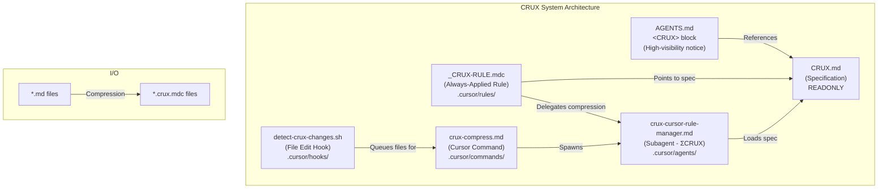
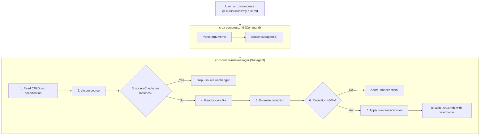
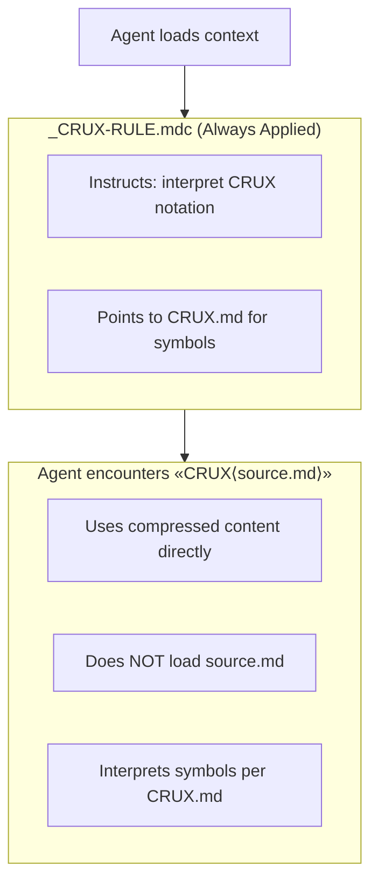
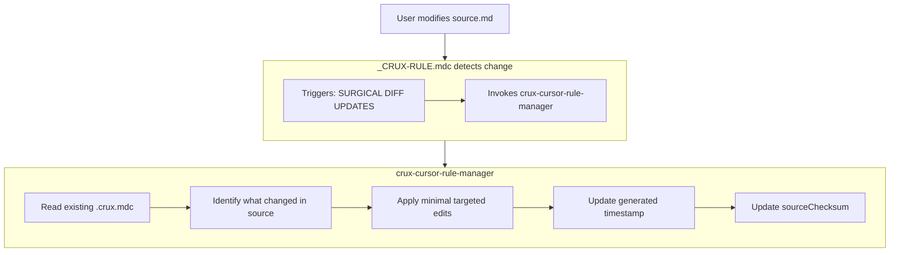

# CRUX System Architecture

This document explains how the CRUX (Context Reduction Using X-encoding) system works in this repository. CRUX achieves 5-10x token reduction for Cursor rules while preserving all actionable information.

## Etymology

**CRUX** = **C**ontext **R**eduction **U**sing **X**-encoding

The "X" is intentionally flexible:
- e**X**pressive symbols (→ ⊳ ⊲ ∋ ∀)
- e**X**tensible notation (custom blocks)
- e**X**change format (compress ↔ expand)

The name also serves as a backronym for "crux" — the decisive or most important point — which is exactly what the compression preserves while stripping everything else.

**Repository**: [github.com/zotoio/CRUX-Compress](https://github.com/zotoio/CRUX-Compress)

## Overview

The CRUX system consists of 6 interconnected components:



## Component Details

### 1. `CRUX.md` - The Specification (Project Root)

**Purpose**: The authoritative specification defining CRUX notation syntax, encoding symbols, and compression rules.

**Key Contents**:
- Encoding symbols (structure, relations, logic, change, qualifiers)
- Standard blocks (`Ρ`, `E`, `Λ`, `Π`, `Κ`, `R`, `P`, `Γ`, `M`, `Φ`, `Ω`)
- Compression rules (eliminate prose, deduplicate, collapse, merge)
- Quality gates (target ≤20% of original token count)
- Example transformations

**Critical Rules**:
- **READONLY** - Agents must NEVER edit this file unless explicitly asked by the user
- All other CRUX components reference this as their source of truth

### 2. `<CRUX>` Block in `AGENTS.md` (Project Root)

**Purpose**: High-visibility notice ensuring ALL agents are aware of CRUX notation before they begin work.

**Location**: Near the top of `AGENTS.md`, the first file agents read.

**Key Contents**:
```xml
<CRUX agents="always">
## CRITICAL: CRUX Notation
...
### Foundational CRUX Rules (MUST FOLLOW)
1. NEVER EDIT `CRUX.md`
2. DO NOT LOAD SOURCE FILES when CRUX exists
3. SURGICAL DIFF UPDATES on source changes
4. ABORT IF NO SIGNIFICANT REDUCTION
</CRUX>
```

**Why It Matters**: This ensures agents know to:
- Load `CRUX.md` to understand compression symbols
- Use CRUX content instead of loading original source files
- Keep CRUX files synchronized when sources change

### 3. `_CRUX-RULE.mdc` - Always-Applied Rule (`.cursor/rules/`)

**Purpose**: A Cursor rule that is always loaded into context, providing agents with instructions for handling CRUX notation.

**Key Functions**:
- **Decompression**: Tells agents to interpret and follow CRUX-compressed rules
- **Compression**: Directs agents to delegate compression tasks to `crux-cursor-rule-manager`
- **Foundational Rules**: Reinforces the 4 critical rules
- **Specification Reference**: Points to `CRUX.md` for full details

**Contents**:
```markdown
# CRUX Decompression - CRITICAL
Always interpret, understand and adhere to the meaning compressed in CRUX notation!

# CRUX Compression - CRITICAL
When asked to compress a markdown rule file, delegate to crux-cursor-rule-manager subagent

# Foundational CRUX Rules (MUST FOLLOW)
1. NEVER EDIT `CRUX.md`
2. DO NOT LOAD SOURCE FILES when CRUX exists
3. SURGICAL DIFF UPDATES on source changes
4. SOURCE CHECKSUM TRACKING - Skip updates if sourceChecksum matches

# CRUX Rule Compression Specification
load from CRUX.md
```

### 4. `crux-cursor-rule-manager.md` - The Subagent (`.cursor/agents/`)

**Purpose**: A specialized AI subagent (ΣCRUX) that performs compression and decompression tasks.

**Capabilities**:
- **Compression**: Convert verbose markdown → compact CRUX notation
- **Decompression**: Explain CRUX notation in natural language
- **Validation**: Verify CRUX output follows specification
- **Semantic Validation**: Compare CRUX to source, produce confidence score
- **Surgical Diff Updates**: Update CRUX files when sources change

**Workflow**:
1. Load `CRUX.md` specification (required first step)
2. Get source file's checksum via `cksum`
3. Check if existing CRUX `sourceChecksum` matches → skip if unchanged
4. Estimate token reduction → abort if <50% reduction
5. Apply compression rules from specification
6. Generate output with frontmatter (generated, sourceChecksum, beforeTokens, afterTokens)
7. Verify quality gates (target ≤20% of original)
8. **Semantic validation**: Fresh agent instance compares CRUX to source, produces confidence score
9. Update frontmatter with `confidence: XX%`

**Output Format**:
```yaml
---
generated: YYYY-MM-DD HH:MM
sourceChecksum: "1234567890 2500"
beforeTokens: 2500
afterTokens: 400
confidence: 92%
alwaysApply: true
---
```

### 5. `crux-compress.md` - The Command (`.cursor/commands/`)

**Purpose**: A Cursor command that orchestrates CRUX compression tasks.

**Usage**:
```
/crux-compress ALL                    - Compress all eligible rules
/crux-compress @path/to/file.md       - Compress a specific file
/crux-compress @file1.md @file2.md    - Compress multiple files
```

**Key Features**:
- **Parallelism**: Spawns up to 4 `crux-cursor-rule-manager` subagents in parallel
- **Batching**: Processes files in batches of 4 when >4 files
- **Source Checksum Tracking**: Skips files whose sourceChecksum hasn't changed
- **Eligibility Criteria**: Files must have `crux: true` frontmatter

**File Convention**:
| Type | Extension | Example |
|------|-----------|---------|
| Source (human-readable) | `.md` | `core-tenets.md` |
| Compressed (token-efficient) | `.crux.mdc` | `core-tenets.crux.mdc` |

### 6. `detect-crux-changes.sh` - The Hook (`.cursor/hooks/`)

**Purpose**: A Cursor hook that automatically detects when source files with `crux: true` are modified and queues them for compression.

**How It Works**:
1. Triggered by the `afterFileEdit` Cursor hook
2. Checks if the edited file is in `.cursor/rules/` with `.md` extension (not `.crux.mdc`)
3. Verifies the file has `crux: true` in its frontmatter
4. Queues the file in `.cursor/hooks/pending-crux-compress.json` for later compression

**Hook Configuration** (`.cursor/hooks.json`):
```json
{
  "version": 1,
  "hooks": {
    "afterFileEdit": [
      {
        "command": "bash .cursor/hooks/detect-crux-changes.sh",
        "description": "Queue modified source files for CRUX compression"
      }
    ]
  }
}
```

**Benefits**:
- Automatically tracks which source files need recompression
- Avoids manual tracking of modified files
- Works with the `/crux-compress` command workflow

## Distribution Package

The CRUX system can be packaged as a standalone zip for use in other projects.

### Creating the Package

```bash
bash .cursor/scripts/create-crux-zip.sh [output-dir]
```

### Package Contents

| File | Purpose |
|------|---------|
| `CRUX.md` | Specification (READONLY) |
| `.cursor/crux-readme.md` | This documentation |
| `.cursor/hooks.json` | Hook configuration |
| `.cursor/hooks/detect-crux-changes.sh` | File change detection hook |
| `.cursor/agents/crux-cursor-rule-manager.md` | Compression subagent |
| `.cursor/commands/crux-compress.md` | Compression command |
| `.cursor/rules/_CRUX-RULE.mdc` | Always-applied rule |

### Installation in Another Project

1. Extract the zip to your project root
2. Ensure `.cursor/hooks.json` is recognized by Cursor
3. Add `crux: true` to any rule files you want to compress
4. Use `/crux-compress ALL` to compress eligible files

## How They Work Together

### Compression Flow



### Decompression Flow (Runtime)



### Synchronization Flow



## Foundational Rules (All Components Enforce)

0. **ALWAYS INTERPRET AND UNDERSTAND ALL CRUX RULES FIRST** - At session start, interpret all CRUX notation in rules. When new rules are added to context, interpret them immediately. Build a mental model of all rules that can be visualized on request.
1. **NEVER EDIT `CRUX.md`** - The specification is read-only
2. **DO NOT LOAD SOURCE FILES when CRUX exists** - Use `«CRUX⟨...⟩»` content directly
3. **SURGICAL DIFF UPDATES** - Keep CRUX files synchronized with source changes
4. **ABORT IF NO SIGNIFICANT REDUCTION** - Target ≤20% of original; skip if not achieved

## File Locations Summary

| Component | Path | Purpose |
|-----------|------|---------|
| Specification | `CRUX.md` | Defines notation syntax |
| Agent Notice | `AGENTS.md` (CRUX block) | High-visibility awareness |
| Always-Applied Rule | `.cursor/rules/_CRUX-RULE.mdc` | Runtime instructions |
| Subagent | `.cursor/agents/crux-cursor-rule-manager.md` | Compression executor |
| Command | `.cursor/commands/crux-compress.md` | User interface |
| Hook | `.cursor/hooks/detect-crux-changes.sh` | Auto-detect file changes |
| Hook Config | `.cursor/hooks.json` | Hook configuration |
| Zip Script | `.cursor/scripts/create-crux-zip.sh` | Create distribution package |

## Quick Reference

### To Compress a Rule File

```
/crux-compress @.cursor/rules/my-rule.md
```

### To Make a File Eligible for Compression

Add to frontmatter:
```yaml
---
crux: true
---
```

### To Check Compression Ratio and Confidence

Compressed files include metrics in frontmatter:
```yaml
beforeTokens: 2500  # Original
afterTokens: 400    # Compressed (16% of original)
confidence: 92%     # Semantic validation score
```

**Confidence Score** indicates how well CRUX preserves semantic meaning:
- ≥90%: Excellent (accept as-is)
- 80-89%: Good (accept)
- 70-79%: Marginal (review)
- <70%: Poor (revise)

### CRUX Notation Quick Reference

```
STRUCTURE:  «»⟨⟩{}[]().sub
COMPARE:    > < ≥ ≤
PRIORITY:   ≻ ≺
DATA FLOW:  → ←
RELATIONS:  ⊳ ⊲ @ : = ∋
LOGIC:      | & ⊤ ⊥ ∀ ∃ ¬
CHANGE:     Δ + -
QUALIFY:    * ? ! #
IMPORTANCE: ⊛ ◊
BLOCKS:     Ρ E Λ Π Κ R P Γ M Φ Ω
```

See `CRUX.md` for complete specification.
