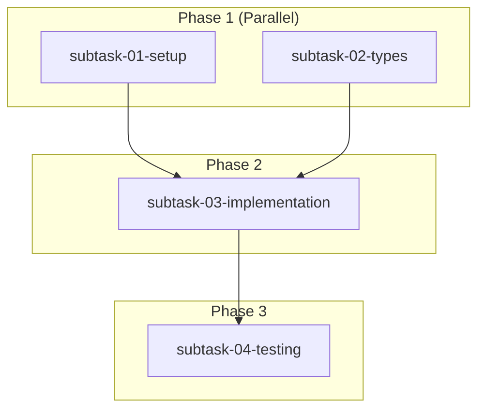

# Creating X-Fidelity Engineering Plans

This skill guides the xfi-planner agent through creating comprehensive engineering plans for complex initiatives.

## Prerequisites

- Clear understanding of the feature/initiative to plan
- Access to xfi-system-design agent for architectural input
- Ability to delegate to appropriate subagents for subtask creation

## Workflow Overview

```
┌─────────────────────────────────────────────────────────────┐
│ 1. Requirements Gathering (up to 10 questions)             │
├─────────────────────────────────────────────────────────────┤
│ 2. Design Consultation (xfi-system-design agent)           │
├─────────────────────────────────────────────────────────────┤
│ 3. USER STOP: Confirm decisions                            │
├─────────────────────────────────────────────────────────────┤
│ 4. Create plan directory and index file                    │
├─────────────────────────────────────────────────────────────┤
│ 5. Delegate subtask file creation to subagents             │
├─────────────────────────────────────────────────────────────┤
│ 6. Review by xfi-code-reviewer and xfi-system-design       │
├─────────────────────────────────────────────────────────────┤
│ 7. USER STOP: Final review                                 │
├─────────────────────────────────────────────────────────────┤
│ 8. Declare plan ready with execution instructions          │
└─────────────────────────────────────────────────────────────┘
```

## Step 1: Requirements Gathering

Ask up to 10 clarifying questions, **one at a time**, building on previous answers.

### Question Categories

1. **Scope**: What is the scope of this initiative?
2. **Goals**: What are the primary goals and success criteria?
3. **Constraints**: Are there any constraints or limitations?
4. **Dependencies**: What existing features/packages does this depend on?
5. **Affected Packages**: Which packages will be impacted?
6. **User Impact**: How will this affect end users?
7. **Testing Strategy**: Any specific testing requirements?
8. **Timeline Sensitivity**: Are there any deadlines or priorities?
9. **Risks**: Any known risks or concerns?
10. **Open Questions**: Anything unclear that needs investigation?

### Question Guidelines

- **STOP after each question** and wait for user response
- **Build on previous answers** - adapt questions based on responses
- **Skip unnecessary questions** if scope is already clear
- **Aim for 5-7 questions** for most initiatives
- **Document key decisions** as you go

## Step 2: Design Consultation

After gathering requirements, consult the **xfi-system-design agent**:

```
Invoke xfi-system-design subagent with:

"Provide architectural input for this initiative:

[Summary of requirements gathered]

Key questions:
1. What packages need to be modified?
2. What is the recommended architecture approach?
3. Are there any design patterns we should follow?
4. What are the main technical risks?
5. Suggest a logical breakdown of subtasks"
```

Capture the design agent's recommendations.

## Step 3: User Confirmation (MANDATORY STOP)

**STOP and present to user:**

```markdown
## Plan Summary for Confirmation

### Initiative: [Name]

### Key Decisions Made:
1. [Decision 1 with rationale]
2. [Decision 2 with rationale]
3. [Decision 3 with rationale]

### Packages Affected:
- [package 1] - [changes needed]
- [package 2] - [changes needed]

### Proposed Subtasks:
1. [Subtask 1] - assigned to [subagent]
2. [Subtask 2] - assigned to [subagent]

### Architecture Approach:
[Summary from xfi-system-design]

### Risks Identified:
- [Risk 1]
- [Risk 2]

---

Do you approve these decisions? Any changes or questions?
```

**Wait for user confirmation before proceeding.**

## Step 4: Create Plan Directory and Index File

Once confirmed, create the plan structure:

### Directory Structure

```bash
knowledge/plans/[YYYYMMDD]-[feature-name]/
```

### Index File Template

Create `index-[feature-name]-[yyyymmdd].md`:

```markdown
# Plan: [Feature Name]

## Status
Draft

## Overview
[High-level description from requirements]

## Key Decisions
- [Decision 1]: [Rationale]
- [Decision 2]: [Rationale]

## Requirements
[Numbered list of requirements gathered]

## Design Notes
[Summary from xfi-system-design consultation]

## Subtask Dependency Graph



## Execution Order

### Phase 1 (Parallel)
| Subtask | Subagent | Description | Dependencies |
|---------|----------|-------------|--------------|
| 01 | xfi-engineer | [Description] | None |
| 02 | xfi-engineer | [Description] | None |

### Phase 2 (After Phase 1)
| Subtask | Subagent | Description | Dependencies |
|---------|----------|-------------|--------------|
| 03 | xfi-engineer | [Description] | 01, 02 |

### Phase 3 (After Phase 2)
| Subtask | Subagent | Description | Dependencies |
|---------|----------|-------------|--------------|
| 04 | xfi-testing-expert | [Description] | 03 |

## Global Definition of Done
- [ ] All subtasks completed
- [ ] All unit tests passing
- [ ] Code review by xfi-code-reviewer completed
- [ ] Architecture review by xfi-system-design completed
- [ ] Global test suite passing (verified by xfi-testing-expert)
- [ ] Documentation updated by xfi-docs-expert
- [ ] Knowledge captured by xfi-system-design
- [ ] User approval received

## Execution Notes
[To be filled during plan execution]

## Completion Checklist
- [ ] Subtask 01: Pending
- [ ] Subtask 02: Pending
- [ ] Subtask 03: Pending
- [ ] Subtask 04: Pending
- [ ] Final code review
- [ ] Final architecture review
- [ ] Global tests verified
- [ ] Documentation updated
- [ ] Knowledge captured
```

## Step 5: Delegate Subtask File Creation

For each subtask, invoke the appropriate subagent to create the subtask file.

### Delegation Template

```
Invoke [subagent-name] subagent with:

"Create a subtask plan file for the following task.

**File to create**: knowledge/plans/[yyyymmdd]-[feature-name]/subtask-[NN]-[feature]-[subtask-name]-[yyyymmdd].md

**IMPORTANT**:
- Only create/edit the subtask markdown file
- Do NOT edit any code files
- Do NOT run any tests
- Include instruction in the file that executing agent should NOT trigger global tests

**Subtask Details**:
- Feature: [Feature name]
- Subtask: [Subtask name]
- Objective: [Clear objective]
- Deliverables: [Expected deliverables]
- Dependencies: [List of dependent subtask IDs or None]

**File Template**:
[Include the subtask file template from xfi-planner agent documentation]

After creating the file, report back with:
1. File path created
2. Summary of deliverables defined
3. Any concerns or questions about the subtask"
```

### Subagent Selection Guide

| Task Type | Subagent |
|-----------|----------|
| General implementation | xfi-engineer |
| Plugin development | xfi-plugin-expert |
| VSCode extension | xfi-vscode-expert |
| Rule/archetype work | xfi-rules-expert |
| Testing strategy | xfi-testing-expert |
| Security-sensitive | xfi-security-expert |
| Build/CI work | xfi-build-expert |

### Collect Results

As each subagent completes:
1. Verify the subtask file was created correctly
2. Update the index file if any new information was discovered
3. Note any concerns raised by subagents

## Step 6: Plan Review

Invoke reviewers in parallel:

### xfi-code-reviewer

```
Invoke xfi-code-reviewer subagent with:

"Review the engineering plan files for completeness and quality:

Plan directory: knowledge/plans/[yyyymmdd]-[feature-name]/

Check for:
1. Clear and achievable deliverables
2. Appropriate subagent assignments
3. Correct dependency ordering
4. Complete definition of done criteria
5. Any gaps or concerns

Provide suggestions for improvements."
```

### xfi-system-design

```
Invoke xfi-system-design subagent with:

"Review the engineering plan for architectural soundness:

Plan directory: knowledge/plans/[yyyymmdd]-[feature-name]/

Check for:
1. Alignment with X-Fidelity architecture
2. Appropriate package assignments
3. Completeness of scope
4. Technical feasibility
5. Risk coverage

Provide suggestions for improvements."
```

### Incorporate Feedback

Update plan files based on reviewer suggestions.

## Step 7: User Final Review (MANDATORY STOP)

**STOP and present to user:**

```markdown
## Plan Ready for Review

### Plan Location
`knowledge/plans/[yyyymmdd]-[feature-name]/`

### Files Created
- `index-[feature-name]-[yyyymmdd].md` (main plan)
- `subtask-01-[feature]-[subtask-name]-[yyyymmdd].md`
- `subtask-02-[feature]-[subtask-name]-[yyyymmdd].md`
- ...

### Review Feedback Incorporated
- [Summary of changes from code reviewer]
- [Summary of changes from system design]

### Execution Summary
- Total subtasks: [N]
- Parallel phases: [N]
- Estimated complexity: [Low/Medium/High]

---

Please review the plan files. When ready to execute, use:
`/xfi-plan-execute`

Any changes needed before finalizing?
```

## Step 8: Finalize Plan

Once user approves:

1. Update index file status to "Ready for Review"
2. Document execution instructions:

```markdown
## Execution Instructions

To execute this plan in a new agent session:

1. Start a new conversation
2. Run: `/xfi-plan-execute`
3. Select this plan: `[yyyymmdd]-[feature-name]`
4. Confirm execution summary
5. Monitor subtask progress
6. Review final changes when prompted
7. Approve documentation updates
```

## Critical Rules

1. **NEVER edit code files** during planning
2. **ALWAYS stop for user confirmation** at Steps 3 and 7
3. **DELEGATE subtask creation** to appropriate subagents
4. **INCLUDE testing restrictions** in all subtask files
5. **CAPTURE all decisions** in the index file
6. **UPDATE index** with discoveries from subagents

## Troubleshooting

### Subagent doesn't create correct file
- Verify the file path is correct
- Ensure template was provided
- Re-invoke with clearer instructions

### Scope too large
- Break into multiple plans
- Phase the implementation
- Prioritize critical subtasks

### Unclear requirements
- Ask additional clarifying questions
- Consult xfi-system-design for guidance
- Document assumptions clearly
