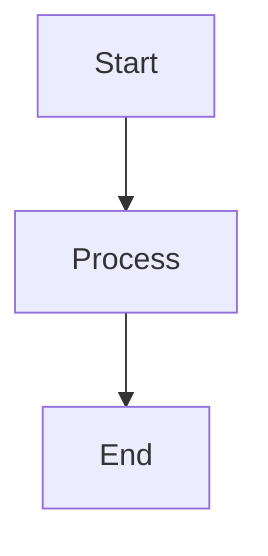

# Updating X-Fidelity Documentation

This skill guides you through keeping documentation in sync with code changes.

## Documentation Locations

| Type | Location | Purpose |
|------|----------|---------|
| Main README | `README.md` | Overview, installation, quick start |
| Website docs | `website/docs/` | Detailed documentation (Docusaurus) |
| Package READMEs | `packages/*/README.md` | Package-specific docs |
| Scripts README | `scripts/README.md` | Development scripts guide |
| VSCode extension | `packages/x-fidelity-vscode/DEVELOPMENT.md` | Extension development |

## Quick Update Checklist

```
Documentation Update:
- [ ] Identify affected documentation
- [ ] Update README.md if needed
- [ ] Update website docs if needed
- [ ] Update package READMEs if needed
- [ ] Run docs validation
- [ ] Preview website changes
- [ ] Commit changes
```

## When to Update Docs

### Code Changes Requiring Doc Updates

| Change Type | Docs to Update |
|-------------|----------------|
| New CLI flag | README, `website/docs/cli-reference.md` |
| New command | README, `website/docs/cli-reference.md` |
| New rule | `website/docs/rules/` |
| New plugin | `website/docs/plugins/` |
| New archetype | README, `website/docs/examples/` |
| Config change | README, `website/docs/` |
| API change | Affected package README |
| VSCode feature | `packages/x-fidelity-vscode/README.md` |

## Updating the Main README

### Structure

```markdown
# x-fidelity

## Overview
Brief description

## Installation
How to install

## Quick Start
Basic usage examples

## Features
Key capabilities

## Documentation
Link to website

## Contributing
Contribution guidelines
```

### CLI Flags Reference

When adding CLI flags, update:
1. `README.md` - Quick reference
2. `website/docs/cli-reference.md` - Detailed docs

## Updating Website Documentation

### Website Structure

```
website/docs/
├── intro.md                    # Introduction
├── quickstart.md               # Getting started
├── cli-reference.md            # CLI commands
├── troubleshooting.md          # Common issues
├── environment-variables.md    # Env config
├── result-files-and-conventions.md
├── ci-cd/                      # CI/CD integration
├── examples/                   # Usage examples
│   └── recipes.md
├── packages/                   # Package docs
│   └── core.md
├── plugins/                    # Plugin docs
│   ├── overview.md
│   └── hello-plugin.md
├── rules/                      # Rules docs
│   ├── hello-rule.md
│   └── rules-cookbook.md
├── server/                     # Server docs
│   └── quick-server-setup.md
└── vscode-extension/           # VSCode docs
    └── features.md
```

### Creating New Doc Pages

**File**: `website/docs/section/new-page.md`

```markdown
---
sidebar_position: 2
---

# Page Title

Description of this topic.

## Section 1

Content here.

## Section 2

More content.
```

### Updating Sidebar

**File**: `website/sidebars.js`

```javascript
module.exports = {
  tutorialSidebar: [
    'intro',
    'quickstart',
    {
      type: 'category',
      label: 'Plugins',
      items: [
        'plugins/overview',
        'plugins/hello-plugin',
        'plugins/new-plugin'  // Add new page
      ],
    },
  ],
};
```

## Previewing Website Changes

```bash
# Start local development server
cd website
yarn install
yarn start

# Opens browser at http://localhost:3000/x-fidelity/
```

### Build for Production

```bash
cd website
yarn build
```

## Docs Validation

### Run Validation Script

```bash
# Validate focused docs (default)
yarn docs:validate

# Validate all docs
FULL_DOCS=1 yarn docs:validate
```

### What Validation Checks

1. **Broken relative links** - Links to other docs that don't exist
2. **JSON code blocks** - Valid JSON syntax in examples
3. **CLI flags** - Referenced flags exist in CLI code

### Focused Docs (Always Validated)

- `quickstart.md`
- `cli-reference.md`
- `vscode-extension/features.md`
- `rules/hello-rule.md`
- `plugins/hello-plugin.md`
- `troubleshooting.md`
- `intro.md`

## Writing Guidelines

### Code Examples

Use fenced code blocks with language:

````markdown
```bash
xfi --archetype node-fullstack
```

```json
{
    "name": "my-archetype",
    "rules": []
}
```
````

### Mermaid Diagrams

Website supports Mermaid diagrams:

````markdown

````

### Admonitions

```markdown
:::note
This is a note.
:::

:::tip
This is a tip.
:::

:::warning
This is a warning.
:::

:::danger
This is dangerous.
:::
```

### Links

```markdown
# Internal link
[CLI Reference](/docs/cli-reference)

# External link
[GitHub](https://github.com/zotoio/x-fidelity)

# Relative link
[Overview](./overview.md)
```

## Package README Updates

### When to Update

- New public API
- Changed installation steps
- New features
- Breaking changes

### Package README Structure

```markdown
# @x-fidelity/{name}

Description of the package.

## Installation

How to install or use as dependency.

## Usage

Code examples.

## API Reference

Public functions and types.

## Development

How to develop this package.
```

## Common Documentation Tasks

### Adding a New CLI Flag

1. Add flag to `packages/x-fidelity-cli/src/cli.ts`
2. Update `README.md`:
```markdown
### New Flag
`--my-flag` - Description
```
3. Update `website/docs/cli-reference.md`:
```markdown
### --my-flag

Description of what this flag does.

**Example:**
```bash
xfi --my-flag value
```
```

### Adding a New Plugin

1. Create plugin (see xfi-create-plugin skill)
2. Create `website/docs/plugins/{plugin-name}.md`
3. Update `website/sidebars.js`
4. Update `website/docs/plugins/overview.md`

### Adding a New Rule

1. Create rule (see xfi-create-rule skill)
2. Create `website/docs/rules/{rule-name}.md`
3. Update `website/sidebars.js`
4. Update `website/docs/rules/rules-cookbook.md`

## CI Documentation Checks

GitHub Actions workflow validates:
- Documentation builds successfully
- No broken links
- CLI flags match code

### Workflow

`.github/workflows/documentation.yml`:
- Runs `yarn docs:validate`
- Builds website
- Deploys on merge to main

## Best Practices

1. **Keep in sync** - Update docs with code changes
2. **Validate before commit** - Run `yarn docs:validate`
3. **Preview changes** - Use local dev server
4. **Use examples** - Show, don't just tell
5. **Be concise** - Clear, direct language
6. **Check links** - Ensure internal links work

## Files Reference

| Purpose | Location |
|---------|----------|
| Main README | `README.md` |
| Website docs | `website/docs/` |
| Sidebar config | `website/sidebars.js` |
| Docusaurus config | `website/docusaurus.config.js` |
| Validation script | `scripts/validate-docs.js` |
| VSCode README | `packages/x-fidelity-vscode/README.md` |
| Dev guide | `packages/x-fidelity-vscode/DEVELOPMENT.md` |
