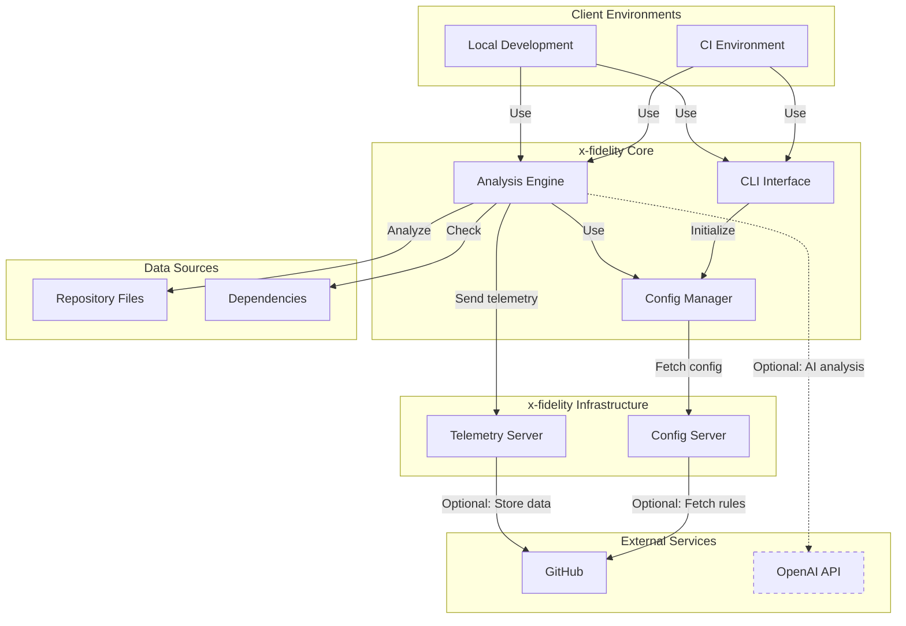

# x-fidelity

x-fidelity is an advanced CLI tool and paired config server designed to perform opinionated framework adherence checks within a codebase. It provides a flexible and extensible way to ensure your projects are using specific standards, tools and best practices.  It is based on https://github.com/CacheControl/json-rules-engine a powerful, lightweight rules engine.

```
╭────────────────────────────────╮
│                                │
│   ██╗  ██╗      ███████╗██╗    │
│   ╚██╗██╔╝      ██╔════╝██║    │
│    ╚███╔╝ █████╗█████╗  ██║    │
│    ██╔██╗ ╚════╝██╔══╝  ██║    │
│   ██╔╝ ██╗      ██║     ██║    │
│   ╚═╝  ╚═╝      ╚═╝     ╚═╝    │
╰────────────────────────────────╯
```

**NEW beta genai docs: https://zotoio.github.io/x-fidelity/**

## Project Structure

This is a monorepo containing the following packages:

- `packages/x-fidelity`: The core X-Fidelity package containing the CLI tool and analysis engine
- `packages/x-fidelity-vscode`: VSCode extension for X-Fidelity integration

## Development Setup

1. Install dependencies:
```bash
yarn install
```

2. Build all packages:
```bash
yarn workspaces run build
```

3. Development workflow:
   - For core package:
     ```bash
     # In packages/x-fidelity
     yarn build:watch
     ```
   - For VSCode extension:
     ```bash
     # In packages/x-fidelity-vscode
     yarn dev
     ```

## Testing

Run tests for all packages:
```bash
yarn workspaces run test
```

Or test individual packages:
```bash
# Test core package
yarn workspace x-fidelity test

# Test VSCode extension
yarn workspace x-fidelity-vscode test
```

## Quick Start

1. Install x-fidelity:
   ```
   yarn global add x-fidelity
   export PATH="$PATH:$(yarn global bin)"
   ```
2. Run cli without parameters to view help
   ```
   xfidelity
   ```
3. Execute in current project directory with built-in demo rules for node-fullstack:
   ```
   xfidelity .
   ```

## Table of Contents

1. [Intent and Purpose](#intent-and-purpose)
2. [Key Features](#key-features)
3. [Components and entity names to understand](#components-and-entity-names-to-understand)
4. [System Architecture](#system-architecture)
5. [Configuring and Extending x-fidelity](#configuring-and-extending-x-fidelity)
   - [Defining Archetypes](#defining-archetypes)
   - [Defining rules](#defining-rules)
   - [Included Operators](#included-operators)
   - [External Plugin Extensions](#external-plugin-extensions)
6. [Installation](#installation)
7. [Usage](#usage)
   - [Basic Usage](#basic-usage)
   - [Advanced Usage](#advanced-usage)
   - [Environment Variables](#environment-variables)
   - [Logging Options](#logging-options)
   - [Local Configuration](#local-configuration)
   - [Remote Configuration](#remote-configuration)
8. [Hosting Config Servers](#hosting-config-servers)
   - [Docker Example](#docker-example)
9. [Exemptions](#exemptions)
10. [GitHub Webhook Endpoints](#github-webhook-endpoints)
10. [CI Pipeline Integration](#ci-pipeline-integration)
11. [OpenAI Integration](#openai-integration)
12. [X-Fi Best Practices](#x-fi-best-practices)
13. [Using .xfi-config.json](#using-xfi-configjson)
14. [Contributing](#contributing)
15. [License](#license)

## Intent and Purpose

x-fidelity aims to streamline the process of maintaining code quality and consistency across projects. By providing a flexible, rule-based system, it allows teams to:

- Enforce bespoke coding standards and best practices
- Ensure consistent project archetype structures
- Maintain up-to-date private dependencies
- Catch potential issues early in the development process
- Integrate GenAI-based advanced code analysis (experimental)

The tool is designed to be highly customizable, allowing teams to define their own archetypes, rules, and checks tailored to their specific needs and tech stacks.

> x-fidelity is not a replacement for standard linting more generalised code analysis tools.  it is intended to help with management of bespoke requirements and as a simple way to experiment with GenAI based code reviews.

## Key Features

- **Flexible Archetype System**: Define custom project archetypes with specific rules and configurations.
- **Customizable Rules**: Create and apply rules for various aspects of your codebase.
- **Directory Structure Validation**: Ensure your project follows a predefined directory structure.
- **Dependency Version Checking**: Verify that your project uses up-to-date dependencies.
- **Content Analysis**: Search for specific patterns or strings within your codebase.
- **Remote Configuration**: Fetch configurations from a remote server for centralized management.
- **OpenAI Integration**: Leverage AI for advanced code analysis and suggestions.
- **Extensible Architecture**: Easily add new operators, facts, rules, and external plugin extensions to suit your needs.
- **Enhanced Remote Validation:** Support for remote string validation via the `invalidRemoteValidation` operator. This operator allows x‑fidelity to send extracted string values to an external API (with interpolated parameters such as "#MATCH#") to validate them. (See the sample rule `invalidSystemIdConfigured-iterative-rule.json` in the demo config.)
- **GitHub Webhook Integration:** The config server now exposes endpoints (e.g. `/github-config-update` and `/github-pull-request-check`) that let you trigger configuration reloads and validation checks automatically when a GitHub event (push or pull request) occurs.

## Components and entity names to understand

- **Archetype**: A predefined configuration template for a specific type of project or technology stack. It defines the rules, operators, facts, and other settings to be applied during analysis.

- **Rule**: A set of conditions and corresponding actions that define a specific check or requirement for the codebase. Rules are used to identify warnings or fatal issues in the codebase.

- **Exemption**: A time-limited waiver for a given git repo for a given rule until a configured expiry date. Exemptions can now be provided either as a single JSON file (e.g. `[archetype]-exemptions.json`) or by placing one or more JSON files in a directory named `[archetype]-exemptions`. Any file in that directory that matches the naming pattern will be merged into the effective exemptions.

- **Operator**: A function that performs a specific comparison or check within a rule. Operators are used to evaluate conditions in rules.

- **Fact**: A piece of information about the codebase or its environment that is collected and used during the analysis process. Facts can include file contents, dependency versions, or other relevant data.

- **Config Server**: A server that hosts and distributes archetype configurations and rules, allowing for centralized management of x-fidelity settings.

- **Telemetry**: Data collected about the usage and performance of x-fidelity, which can be used for improving the tool and understanding its impact.

## System Architecture

The following diagram illustrates the overall architecture of the x-fidelity system:



This diagram shows the main components of x-fidelity and how they interact:

- **Client Environments**: Where x-fidelity is used (CI systems or local development).
- **x-fidelity Core**: The main components of the system, including the analysis engine, CLI interface, and configuration manager.
- **x-fidelity Infrastructure**: Servers for configuration and telemetry.
- **External Services**: GitHub for repository interaction and optional OpenAI integration. Includes GitHub Webhooks for triggering config refresh.
- **Remote Validation**: Within the plugins outlined under "Extensions".
- **Enhanced Telemetry**: Flows from both client and server to the Telemetry Server.
- **Data Sources**: The files and dependencies that x-fidelity analyzes.

## Configuring and Extending x-fidelity

x-fidelity is designed to be highly extensible, and only has demo rules and archetypes until you define your required configurations. You can add custom rules, operators, facts, and archetypes:

1. **Custom Archetypes**: Define new archetypes as JSON files in your local config directory or on your config server.
2. **Custom Rules**: Add new JSON rule files in the `rules` subdirectory of your local config or on your config server.
3. **Plugins**: Specify plugins in your archetype configuration or via the CLI to extend functionality with facts and operators.
 
> At minimum you should configure your archetypes rules using the facts and operators provided by the included plugins, which are intended to be flexible enough for general codebase analysis rules.  You can add your own plugins to suit specific needs you have.

### Defining Archetypes
Archetypes represent a pattern or template of git repo that you expect to be consistent.  They consist of:

- **rules**: names of rules you have defined to perform either global (repo wide) checks, or checks on each file in a repo.
- **plugins**: names of plugins to load when using this archetype. These extend the functionality with custom facts and operators.

> **facts**: provided by plugins, these collect and prepare data before analysing repo files such as dependency data and file structures.

> **operators**: provided by plugins, these compare facts and return a boolean result.  In x-fi boolean true means a rule failure. 

- **config**: core configuration related to codebase analysis:
- minimumDependencyVersions: packages you want to conform to provided semver ranges.
- standardStructure: expected filesystem directories at high level
- blacklistPatterns: array of regex applied to filesystem paths to not include in analysis
- whitelistPatterns: array of regex applied to filesystem paths to include in analysis (after blacklist applied)

Example of a custom archetype JSON file (`my-custom-archetype.json`):

```json
{
    "rules": ["myCustomRule-global", "standardRule1-iterative", "standardRule2-iterative"],
    "plugins": ["xfiPluginRequiredFiles", "myCustomPlugin"],
    "config": {
        "minimumDependencyVersions": {
            "my-framework": ">2.0.0"
        },
        "standardStructure": {
            "src": {
                "components": null,
                "utils": null
            },
            "tests": null
        },
        "blacklistPatterns": [".*\\/\\..*", ".*\\/(dist|build)(\\/.*|$)"],
        "whitelistPatterns": [".*\\.(ts|tsx|js|jsx)$"]
    }
}
```
### Defining rules
Example of a custom rule JSON file (`myCustomRule-iterative.json`) that warns of files containing 'TODO':

```json
{
    "name": "myCustomRule-iterative",
    "conditions": {
        "all": [
            {
                "fact": "fileData",
                "path": "$.fileContent",
                "operator": "fileContains",
                "value": "TODO"
            }
        ]
    },
    "event": {
        "type": "warning",
        "params": {
            "message": "TODO comments should be resolved before committing",
            "details": {
                "fact": "fileData",
                "path": "$.filePath"
            }
        }
    }
}
```

Note on rule event types:
- Events of type "warning" are treated as such and do not cause the tool to return an error code.
- Events of type "fatality" are strictly enforced and will cause the tool to return an error code 1.

## Included Operators

x-fidelity includes several custom operators that can be used in your rules. Here's a brief overview of each.  Note that the fileName 'REPO_GLOBAL_CHECK' is not an actual file.  Currently it is used to separate global and iterative rules through inclusion and exclusion.

There are a number of basic boolean check operators inherited from the json-rules-engine package that x-fidelity uses:  https://github.com/CacheControl/json-rules-engine/blob/master/docs/rules.md#operators

### `fileContains` Operator

The `fileContains` operator checks if a file contains specific patterns. It supports an array of patterns for flexible content matching.

Usage example:
```json
{
    "name": "noDatabases-iterative",
    "conditions": {
        "all": [
            {
                "fact": "fileData",
                "path": "$.fileName",
                "operator": "notEqual",
                "value": "REPO_GLOBAL_CHECK"
            },
            {
                "fact": "repoFileAnalysis",
                "params": {
                    "checkPattern": [".*oracle.*"],
                    "resultFact": "fileResultsDB"
                },
                "operator": "fileContains",
                "value": true
            }
        ]
    },
    "event": {
        "type": "warning",
        "params": {
            "message": "code must not directly call databases",
            "details": {
                "fact": "fileResults-DB"
            }
        }
    }
}
```

This operator returns true if any of the patterns in the array are found in the file content.

### `outdatedFramework` Operator

The `outdatedFramework` operator checks if the project is using outdated versions of dependencies. It compares the installed versions of dependencies against the minimum required versions specified in the archetype configuration.

Key features:
- Supports both npm and Yarn package managers
- Handles version ranges and specific versions
- Checks nested dependencies
- Returns `true` if any dependency is outdated, triggering a rule failure event

Usage example in a rule:
```json
{
    "name": "outdatedFramework-global",
    "conditions": {
        "all": [
            {
                "fact": "fileData",
                "path": "$.fileName",
                "operator": "equal",
                "value": "REPO_GLOBAL_CHECK"
            },
            {
                "fact": "repoDependencyAnalysis",
                "params": {
                    "resultFact": "repoDependencyResults"
                },
                "operator": "outdatedFramework",
                "value": true
            }
        ]
    },
    "event": {
        "type": "fatality",
        "params": {
            "message": "some core framework dependencies have expired!",
            "details": {
                "fact": "repoDependencyResults"
            }
        }
    }
}
```

### `nonStandardDirectoryStructure` Operator

The `nonStandardDirectoryStructure` operator verifies if the project follows the standard directory structure defined in the archetype. It recursively checks the project's directory structure against the specified standard structure.

Key features:
- Performs a deep comparison of the directory structure
- Ignores files and focuses only on directory structure
- Returns `true` if the structure doesn't match, triggering a rule failure
- Only runs on the special `REPO_GLOBAL_CHECK` file to ensure a single, comprehensive check

Usage example in a rule:
```json
{
    "name": "nonStandardDirectoryStructure-global",
    "conditions": {
        "all": [
            {
                "fact": "fileData",
                "path": "$.fileName",
                "operator": "equal",
                "value": "REPO_GLOBAL_CHECK"
            },
            {
                "fact": "fileData",
                "path": "$.filePath",
                "operator": "nonStandardDirectoryStructure",
                "value": {
                    "fact": "standardStructure"
                }
            }
        ]
    },
    "event": {
        "type": "warning",
        "params": {
            "message": "directory structure does not match the standard.",
            "details": {
                "fact": "standardStructure"
            }
        }
    }
}
```
- **invalidRemoteValidation:** This operator is provided by the xfiPluginRemoteStringValidator plugin. It validates extracted string data by sending a request to a remote endpoint (using customizable HTTP method, headers, and a JSON body where "#MATCH#" is interpolated) and uses a JSONPath check on the response to decide if the value is valid.

The 'openaiAnalysisHighSeverity' operator will be discussed in the section on the optional OpenAI integration feature.

## Installation

Install x-fidelity using Node.js 18+ and Yarn:

```sh
yarn global add x-fidelity
export PATH="$PATH:$(yarn global bin)"
```

For persistent access, add the PATH line to your `~/.bashrc` or `~/.zshrc` file.

## Usage

### Basic Usage

Run x-fidelity in your project directory:

```sh
xfidelity
```

### Advanced Usage

### Telemetry & Monitoring

- Telemetry data is sent to a configurable endpoint via the `-t`/`--telemetryCollector` option.
- Analysis start, analysis end (including error events) are issued via telemetry, with optional shared secret headers.
- The CLI and config server now include built-in logging and telemetry support.

Use command-line options for more control:

```sh
Usage: x-fidelity [options] [directory]

Arguments:
  directory                                      code directory to analyze

Options:
  -d, --dir [directory]                          code directory to analyze. if an arg was passed to command it
                                                 will be treated as the dir (default: ".")
  -a, --archetype [archetype]                    The archetype to use for analysis (default: "node-fullstack")
  -c, --configServer [configServer]              The config server URL for fetching remote archetype
                                                 configurations and rules
  -o, --openaiEnabled [boolean]                 Enable OpenAI analysis (default: false)
  -t, --telemetryCollector [<telemetryCollector]  The URL telemetry data will be sent to for usage analysis
  -m, --mode [mode]                              Run mode: 'client' or 'server' (default: "client")
  -p, --port [port]                              The port to run the server on (default: "8888")
  -l, --localConfigPath [path]                   Path to local archetype config and rules
  -j, --jsonTTL [minutes]                        Set the server JSON cache TTL in minutes (default: "10")
  -e, --extensions <modules...>                  Space-separated list of npm module names to load as external plugin extensions
  -x, --examine                                  Validate archetype config only
  -v, --version                                  Output the version number of xfidelity
  -h, --help                                     Display help for command
```

Examples:

```sh
# Run client to analyse current dir using config from remote config server
xfidelity --configServer http://localhost:8888

# Analyze a specific directory with java-microservice archetype config from remote config server and enable OpenAI analysis
xfidelity /home/projects/my-codebase -a java-microservice -c https://localhost:8888 -o true

# Run in config server mode with custom port
xfidelity --mode server --port 9999 

# Use local config and rules
xfidelity -l /path/to/local/config

# Set custom cache TTL for server mode with local rules
xfidelity --mode server -l /path/to/local/config --jsonTTL 30
```

### Environment Variables

x-fidelity supports the following environment variables:

- `OPENAI_API_KEY`: Your OpenAI API key for AI-powered analysis.
- `OPENAI_MODEL`: The OpenAI model to use (default is 'gpt-4o').
- `XFI_LISTEN_PORT`: The port for the config server to listen on (default is 8888).
- `CERT_PATH`: The path to SSL certificates for HTTPS config server.
- `NODE_TLS_REJECT_UNAUTHORIZED`: Set to '0' to allow self-signed certificates (use with caution).
- `XFI_SHARED_SECRET`: Shared secret for securing telemetry and certain server routes.
- `XFI_LOG_COLOR`: Set to 'false' to disable colored output in logs.

Example usage:

```sh
export OPENAI_API_KEY=your_api_key_here
export OPENAI_MODEL=gpt-4
export XFI_LISTEN_PORT=9999
export XFI_SHARED_SECRET=your_shared_secret_here
export XFI_LOG_COLOR=false
xfidelity -o true
```

### Local Configuration

To use local configuration files for archetypes and rules, use the `-l` or `--localConfigPath` option:

```sh
xfidelity -l /path/to/local/config
```

The local config directory should contain:
- Archetype JSON files (e.g., `node-fullstack.json`)
- A `rules` subdirectory containing rule JSON files

You can override default archetypes or add new ones by placing the corresponding JSON files in the local config directory.

### Logging Options

x-fidelity provides options to customize the logging output:

1. **Log Level**: Set the logging level using the `XFI_LOG_LEVEL` environment variable:
   ```sh
   export XFI_LOG_LEVEL=debug
   ```
   Available levels: trace, debug, info, warn, error, fatal

2. **Colored Output**: You can disable colored logging output using an environment variable:
   ```sh
   export XFI_LOG_COLOR=false
   ```

This is particularly useful in CI/CD environments or when redirecting logs to files.

### Remote Configuration

To use a remote configuration server, use the `-c` or `--configServer` option:

```sh
xfidelity -c https://config-server.example.com
```

The remote server is also the xfidelity cli configured in server mode to serve archetype and rule configurations.

## GitHub Webhook Endpoints

The config server now supports GitHub webhook endpoints for real‑time updates:
- **`/github-config-update`** – triggered on push events to clear the cache and refresh local configurations.
- **`/github-pull-request-check`** – reserved for future pull-request–related validations.
These endpoints require validation via secret headers and are configured via the `GITHUB_WEBHOOK_SECRET` environment variable.

## Hosting Config Servers

x-fidelity allows for centrally managed, hot-updatable custom rulesets that can be executed within managed CI pipelines and locally, ensuring consistency of applied rules. Here's an overview of the setup required:

1. Set up a Node.js host environment (Docker containerization recommended).
2. Create a GitHub repository to host your archetypes and rules.
3. Clone the GitHub repository to the server filesystem.
4. Install the x-fidelity CLI on the server.
5. Configure the CLI to:
   - Run on startup in server mode (`--mode server`)
   - Point to your rules directory cloned from GitHub (`--localConfigPath ../rule-repo/config`)
   - Optionally set the port to listen on (`--port [port]`)
6. Create a simple CI pipeline step 'framework fidelity' after git repo clone to workspace:
   - Install the x-fidelity CLI
   - Run the CLI on the checked-out repo, pointing to the server (`--configServer http://my-server:8888`)

> Performance report for config server for 30k requests over 5mins https://app.artillery.io/share/sh_98c74c2e592b6d3fdd326570c3e90caaac318697e2009980ac8d35309685df36

### Docker Example

x-fidelity server can run in Docker for easy deployment and configuration.  Here is a basic example for local testing.  A full repo example is available here: todo

#### Using Docker Compose

1. Ensure you have Docker and Docker Compose installed on your system.
2. Create a `docker-compose.yml` file with the following content:

   ```yaml
   services:
     x-fidelity-server:
       build: .
       ports:
         - 8888:8888
       volumes:
         - ./src:/usr/src/app/src
         - ../xfi-server/xfi-config:/usr/src/app/config
       environment:
         - NODE_ENV=production
         - XFI_LISTEN_PORT=8888
         - CERT_PATH=/usr/src/app/certs
   ```

3. Run the following command to start the x-fidelity server:

   ```
   docker-compose up --build
   ```

#### Using a Dockerfile without compose

If you prefer to use the Dockerfile directly:

1. Build the Docker image:

   ```
   docker build -t x-fidelity .
   ```

2. Run the container:

   ```
   docker run -p 8888:8888 -v /path/to/local/config:/usr/src/app/config x-fidelity
   ```

The Dockerfile includes the following features:
- Automatic generation of self-signed SSL certificates for HTTPS support
- Installation of x-fidelity from npm
- Configuration of environment variables for port and certificate path

#### HTTPS/TLS Support

x-fidelity generates self-signed SSL certificates automatically when running in Docker. This enables HTTPS support out of the box. 

> Note: When testing the server using the self-signed certificate, you may need to set the following environment variable on x-fidelity clients:
> ```
> NODE_TLS_REJECT_UNAUTHORIZED=0
> ```
> Use this with caution and only in testing environments.

#### Serving local Configuration

When testing using the Docker examples, you can mount your local configuration and source files:

- `/usr/src/app/src`: Mount your local source files here
- `/usr/src/app/config`: Mount your local x-fidelity configuration files here

## Exemptions

Exemptions in x-fidelity provide a way to temporarily waive specific rules for a given repository. This feature is useful when you need to make exceptions to your standard rules due to specific project requirements or during a transition period.  Exemptions are only able to be trusted when used in the context of an immutable CI pipeline with config managed by a central governing team.

### How Exemptions Work

1. **Definition**: An exemption is defined for a specific rule and repository URL, with an expiration date and a reason.

2. **Storage**: Exemptions are stored in JSON files, typically named `[archetype]-exemptions.json` (e.g., `node-fullstack-exemptions.json`).  NEW a directory named [archetype]-exemptions can be created in the config dir and each json file matching `*-[archetype]-exemptions.json`will also be included.

3. **Structure**: Each exemption is an object with the following properties:
   - `repoUrl`: The URL of the repository where the exemption applies.
   - `rule`: The name of the rule being exempted.
   - `expirationDate`: The date when the exemption expires (format: "YYYY-MM-DD").
   - `reason`: A brief explanation for the exemption.

4. **Application**: When x-fidelity runs, it checks if there's an active exemption for each rule violation before reporting it.

5. **Expiration**: Exemptions automatically expire after the specified date, ensuring that exceptions don't become permanent without review.

### Managing Exemptions

1. **Creating Exemptions**: Add new exemptions to the appropriate exemptions JSON file.

2. **Reviewing Exemptions**: Regularly review active exemptions to ensure they're still necessary.

3. **Removing Exemptions**: Remove expired or unnecessary exemptions from the JSON file.

4. **Centralized Management**: Store exemption files alongside your archetype configurations for easy management and version control.

### Example Exemption

```json
[
  {
    "repoUrl": "https://github.com/example/project",
    "rule": "outdatedFramework-global",
    "expirationDate": "2024-12-31",
    "reason": "Upgrading dependencies is scheduled for Q4 2024"
  }
]
```

### Guidance for exemptions

1. **Limited Duration**: Set short-term expiration dates and renew if necessary, rather than setting far-future dates.
2. **Clear Documentation**: Always provide a clear reason for each exemption.
3. **Regular Review**: Periodically review all exemptions to ensure they're still required.
4. **Minimal Use**: Use exemptions sparingly to maintain the integrity of your code standards.
5. **Team Communication**: Ensure the team is aware of active exemptions and the reasons behind them.

By using exemptions judiciously, you can maintain high code standards while allowing for necessary flexibility in specific situations.

## CI Pipeline Integration

In your CI pipeline (e.g., GitHub Actions, GitLab CI, Jenkins), add a step to run x-fidelity in client mode:

```yaml
steps:
  - name: Check out code
    uses: actions/checkout@v2

  - name: Install x-fidelity
    run: yarn global add x-fidelity

  - name: Run x-fidelity
    run: xfidelity . --configServer http://x-fidelity-server:8888
```

This setup allows you to maintain a centralized set of rules and archetypes that can be easily updated and applied across all your projects.

## OpenAI Integration

x-fidelity offers advanced AI-powered code analysis through integration with OpenAI's language models. This feature provides in-depth insights and suggestions for improving your codebase.

> [!IMPORTANT]
> Carefully consider the costs and data privacy implications before enabling OpenAI integration, especially for large codebases or sensitive projects.

### How It Works

1. **Data Collection**: x-fidelity gathers relevant information about your codebase, including file contents, structure, and dependencies.

2. **AI Analysis**: This data is sent to OpenAI's API, where it's analyzed by a powerful language model (default is GPT-4o).

3. **Insights Generation**: The AI generates detailed insights, suggestions, and potential issues based on best practices, common pitfalls, and the specific context of your project.

4. **Results Integration**: These insights are integrated into x-fidelity's output, providing you with AI-enhanced analysis alongside the tool's standard checks.

### Key Features

- **Code Quality Assessment**: Identifies potential bugs, anti-patterns, and areas for improvement.
- **Architecture Suggestions**: Offers insights on overall code structure and architectural decisions.
- **Performance Optimization**: Highlights areas where performance could be improved.
- **Security Analysis**: Flags potential security vulnerabilities.
- **Best Practices**: Suggests adherence to industry-standard best practices.

### Limitations and Considerations

- **Cost**: Using OpenAI's API incurs charges based on the amount of text processed.
- **Privacy**: Code snippets are sent to OpenAI's servers for analysis. Ensure this complies with your organization's data policies.
- **Accuracy**: While highly advanced, AI suggestions should be reviewed by human developers for context and applicability.
- **Rate Limits**: OpenAI's API has rate limits that may affect analysis of very large codebases.

### Setup and Usage

To enable AI-powered code analysis:

1. Sign up for an [OpenAI API key](https://platform.openai.com).
2. Set the OPENAI_API_KEY environment variable:

```sh
export OPENAI_API_KEY=your_openai_api_key
```

3. Enable OpenAI analysis when running x-fidelity:

```sh
xfidelity . -o true
```

You can also set the OpenAI model using an environment variable (optional):

```sh
export OPENAI_MODEL=gpt-4  # Optional, default is gpt-4o
```

By leveraging OpenAI's advanced language models, x-fidelity provides a unique blend of rule-based checks and AI-powered insights, offering a comprehensive analysis of your codebase that goes beyond traditional static analysis tools.

### Creating Custom OpenAI Rules

You can create custom OpenAI rules to leverage AI-powered analysis for specific aspects of your codebase. Here's how to create a new OpenAI rule:

> [!IMPORTANT]
> By convention, all OpenAI rules must have a name starting with 'openai'. This naming convention is used to identify and handle OpenAI-specific rules in the system.

1. Create a new JSON file in your rules directory (e.g., `openaiCustomAnalysis-global-rule.json`).
2. Use the following template structure for your rule:

```json
{
    "name": "openaiCustomAnalysis-global",
    "conditions": {
        "all": [
            {
                "fact": "fileData",
                "path": "$.fileName",
                "operator": "equal",
                "value": "REPO_GLOBAL_CHECK"
            },
            {
                "fact": "openaiAnalysis",
                "params": {
                    "prompt": "Your custom prompt here",
                    "resultFact": "openaiCustomAnalysisResult"
                },
                "operator": "openaiAnalysisHighSeverity",
                "value": 8
            }
        ]
    },
    "event": {
        "type": "warning",
        "params": {
            "message": "Custom message for the warning",
            "details": {
                "fact": "openaiCustomAnalysisResult"
            }
        }
    }
}
```

3. Customize the rule:
   - Set a unique `name` for your rule, ensuring it starts with 'openai' and ends with '-global'.
   - Modify the `prompt` in the `params` section to specify what you want the AI to analyze.
   - Adjust the `value` in the `openaiAnalysisHighSeverity` operator to set the severity threshold (1-10).
   - Customize the `message` in the `event` params to describe the warning.

4. Add your new rule to the appropriate archetype configuration file.

This structure allows you to create custom AI-powered rules that can analyze your codebase for specific patterns, best practices, or potential issues. Remember to follow the naming convention to ensure proper handling of OpenAI rules in the system.

## X-Fi Best Practices

1. **Version Control**: Keep your x-fidelity configurations (archetypes and rules) in version control.
2. **Continuous Integration**: Integrate x-fidelity checks into your CI/CD pipeline.
3. **Regular Updates**: Keep your archetypes, rules, and dependencies up to date.
4. **Documentation**: Document custom rules, operators, and archetypes for your team.
5. **Gradual Implementation**: When introducing x-fidelity to an existing project, start with basic checks and gradually increase strictness.
6. **Team Alignment**: Ensure your team understands and agrees on the rules being enforced.
7. **Performance**: Be mindful of the performance impact, especially for large codebases.
8. **Centralized Management**: Use a config server to manage and distribute your archetypes and rules across projects.

## Using .xfi-config.json

The `.xfi-config.json` file allows you to configure x-fidelity behavior specific to your repository. This file should be placed in the root of your project directory.

### Configuration Options

The `.xfi-config.json` file supports the following options:

1. `sensitiveFileFalsePositives`: An array of file paths that should be excluded from sensitive data checks.
2. `additionalPlugins`: An array of plugin module names to load for this repository.
3. `additionalRules`: An array of custom rule definitions to add to the archetype's rules.

Example `.xfi-config.json`:

```json
{
  "sensitiveFileFalsePositives": [
    "path/to/exclude/file1.js",
    "path/to/exclude/file2.ts"
  ],
  "additionalPlugins": [
    "xfiPluginSimpleExample"
  ],
  "additionalRules": [
    {
      "name": "custom-rule",
      "conditions": {
        "all": [
          {
            "fact": "fileData",
            "path": "$.fileName",
            "operator": "equal",
            "value": "REPO_GLOBAL_CHECK"
          },
          {
            "fact": "customFact",
            "operator": "customOperator",
            "value": "custom fact data"
          }
        ]
      },
      "event": {
        "type": "warning",
        "params": {
          "message": "Custom rule detected matching data",
          "details": {
            "fact": "customFact"
          }
        }
      }
    }
  ]
}
```

### How It Works

- When x-fidelity runs, it looks for the `.xfi-config.json` file in your project's root directory.
- If found, it applies the configurations specified in this file.
- For `sensitiveFileFalsePositives`, the specified files will be excluded from checks that look for sensitive data, such as API keys or passwords.
- For `additionalPlugins`, the specified plugins will be loaded, making their facts and operators available.
- For `additionalRules`, the specified rules will be added to the archetype's rules.

### How to use it

1. **Version Control**: Include `.xfi-config.json` in your version control system to ensure consistency across your team.
2. **Documentation**: Add comments in the listed file explaining why it is a false positive or why custom rules are needed.
3. **Regular Review**: Periodically review your `.xfi-config.json` to ensure the configurations are still necessary and valid.
4. **Minimal Use**: Use exclusions and custom rules sparingly. It's better to fix issues than to exclude them from checks.
5. **Feedback**: If the rules being applied are resulting in too many false-positives, speak with the team that manages your central rule config.

Remember, while `.xfi-config.json` allows you to adjust x-fidelity's behavior, it should be used judiciously to maintain the integrity of your code quality checks.

### Using Plugins

There are three ways to load plugins in addition to the built-in plugins:

1. **Via --extra-plugins CLI option**: Pass plugin module names via the `-e` (or `--extra-plugins`) CLI option.
2. **Via the plugins array in the archetype configuration**: Specify plugins in the `plugins` array of your archetype JSON file.
3. **Via the plugins array in the .xfi-config file** in the repo root

x-fidelity supports custom plugins through npm modules. To use extensions:

1. Install the extension packages:
```bash
yarn global add xfi-basic-plugin xfi-another-plugin
```

2. Run x-fidelity with the extensions:
```bash
xfidelity -e xfi-basic-plugin xfi-another-plugin
```

Multiple extensions can be specified by separating them with spaces.

Alternatively, specify plugins in your archetype configuration:
```json
{
    "name": "my-archetype",
    "plugins": ["xfi-basic-plugin", "xfi-another-plugin"],
    // other archetype properties...
}
```

Plugins specified in both the CLI and the archetype will be loaded, with CLI-specified plugins loaded first.

### Creating Extensions

You can create custom extensions by implementing the XFiPlugin interface:

```typescript
interface XFiPlugin {
  name: string;
  version: string;
  facts?: {
    name: string;
    fn: Function;
  }[];
  operators?: OperatorDefn[];
}
```

Example extension:
```javascript
module.exports = {
  name: 'my-extension',
  version: '1.0.0',
  facts: [{
    name: 'myCustomFact',
    fn: async () => ({ result: 'custom data' })
  }],
  operators: [{
    name: 'myCustomOperator',
    fn: (factValue, expectedValue) => factValue === expectedValue
  }]
};
```

### External Plugin Extensions

x-fidelity now supports external plugin extensions that allow you to extend its core functionality without modifying the main codebase. These plugins conform to the XFiPlugin interface and can be loaded at runtime.

**How to use external plugin extensions:**
1. Install the extension package(s) via npm. For example, run:
   ```bash
   yarn global add xfi-basic-plugin xfi-another-plugin
   ```
2. Start x-fidelity and pass the extension names using the `-e` or `--extra-plugins` option:
   ```bash
   xfidelity /path/to/project -e xfi-basic-plugin xfi-another-plugin
   ```
   
You can specify multiple plugins, separated by spaces.

For more details on creating your own plugin extensions, please refer to the [PLUGIN_GUIDANCE.md](PLUGIN_GUIDANCE.md) file.

## Contributing

Contributions to x-fidelity are welcome! Please refer to the `CONTRIBUTING.md` file for guidelines on how to contribute to this project.

## License

This project is licensed under the MIT License.. See the `LICENSE` file for details.
