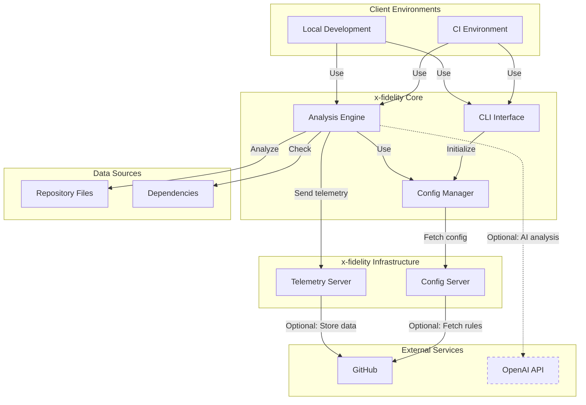

# x-fidelity

x-fidelity is an advanced CLI tool and paired config server designed to perform opinionated framework adherence checks within a codebase. It provides a flexible and extensible way to ensure your projects are using specific standards, tools and best practices.

```
=====================================
 __    __          ________  ______ 
| ##  | ##        | ######## \######
 \##\/  ## ______ | ##__      | ##  
  >##  ## |      \| ##  \     | ##  
 /  ####\  \######| ######    | ##  
|  ## \##\        | ##       _| ##_ 
| ##  | ##        | ##      |   ## \
 \##   \##         \##       \######
                               
-------------------------------------
```

## Quick Start

1. Install x-fidelity:
   ```
   yarn global add x-fidelity
   export PATH="$PATH:$(yarn global bin)"
   ```
2. Run cli without parameters to view help
   ```
   xfidelity
   ```
3. Execute in current project directory with built-in demo rules for node-fullstack:
   ```
   xfidelity .
   ```
4. For more options:
   ```
   xfidelity --help
   ```

## Table of Contents

1. [Intent and Purpose](#intent-and-purpose)
2. [Key Features](#key-features)
3. [System Architecture](#system-architecture)
4. [Installation](#installation)
5. [Usage](#usage)
6. [Configuration](#configuration)
7. [Extending x-fidelity](#extending-x-fidelity)
8. [OpenAI Integration](#openai-integration)
9. [Hosting Config Servers](#hosting-config-servers)
10. [Best Practices](#best-practices)
11. [Contributing](#contributing)
12. [License](#license)

## Intent and Purpose

x-fidelity aims to streamline the process of maintaining code quality and consistency across projects. By providing a flexible, rule-based system, it allows teams to:

- Enforce bespoke coding standards and best practices
- Ensure consistent project archetype structures
- Maintain up-to-date private dependencies
- Catch potential issues early in the development process
- Integrate GenAI-based advanced code analysis (experimental)

The tool is designed to be highly customizable, allowing teams to define their own archetypes, rules, and checks tailored to their specific needs and tech stacks.

> x-fidelity is not a replacement for standard linting more generalised code analysis tools.  it is intended to help with management of bespoke requirements and as a simple way to experiment with GenAI based code reviews.

## Key Features

- **Flexible Archetype System**: Define custom project archetypes with specific rules and configurations.
- **Customizable Rules**: Create and apply rules for various aspects of your codebase.
- **Directory Structure Validation**: Ensure your project follows a predefined directory structure.
- **Dependency Version Checking**: Verify that your project uses up-to-date dependencies.
- **Content Analysis**: Search for specific patterns or strings within your codebase.
- **Remote Configuration**: Fetch configurations from a remote server for centralized management.
- **OpenAI Integration**: Leverage AI for advanced code analysis and suggestions.
- **Extensible Architecture**: Easily add new operators, facts, and rules to suit your needs.

## System Architecture

The following diagram illustrates the overall architecture of the x-fidelity system:



This diagram shows the main components of x-fidelity and how they interact:

- **Client Environments**: Where x-fidelity is used (CI systems or local development).
- **x-fidelity Core**: The main components of the system, including the analysis engine, CLI interface, and configuration manager.
- **x-fidelity Infrastructure**: Servers for configuration and telemetry.
- **External Services**: GitHub for repository interaction and optional OpenAI integration.
- **Data Sources**: The files and dependencies that x-fidelity analyzes.

## Installation

Install x-fidelity using Node.js 18+ and Yarn:

```sh
yarn global add x-fidelity
export PATH="$PATH:$(yarn global bin)"
```

For persistent access, add the PATH line to your `~/.bashrc` or `~/.zshrc` file.

## Usage

### Basic Usage

Run x-fidelity in your project directory:

```sh
xfidelity
```

### Advanced Usage

Use command-line options for more control:

```sh
Usage: x-fidelity [options] [directory]

Arguments:
  directory                                      code directory to analyze

Options:
  -d, --dir <directory>                          code directory to analyze. if an arg was passed to command it
                                                 will be treated as the dir (default: ".")
  -a, --archetype <archetype>                    The archetype to use for analysis (default: "node-fullstack")
  -c, --configServer <configServer>              The config server URL for fetching remote archetype
                                                 configurations and rules
  -o, --openaiEnabled <boolean>                  Enable OpenAI analysis (default: false)
  -t, --telemetryCollector <telemetryCollector>  The URL telemetry data will be sent to for usage analysis
  -m, --mode <mode>                              Run mode: 'client' or 'server' (default: "client")
  -p, --port <port>                              The port to run the server on (default: "8888")
  -l, --localConfigPath <path>                   Path to local archetype config and rules
  -j, --jsonTTL <minutes>                        Set the server json cache TTL in minutes (default: "10")
  -v, --version                                  Output the version number of xfidelity
  -h, --help                                     Display help for command
```

Examples:

```sh
# Run client to analyse current dir using config from remote config server
xfidelity --configServer http://localhost:8888

# Analyze a specific directory with java-microservice archetype config from remote config server and enable OpenAI analysis
xfidelity /home/projects/my-codebase -a java-microservice -c https://localhost:8888 -o true

# Run in config server mode with custom port
xfidelity --mode server --port 9999 

# Use local config and rules
xfidelity -l /path/to/local/config
```

### Environment Variables

x-fidelity supports the following environment variables:

- `OPENAI_API_KEY`: Your OpenAI API key for AI-powered analysis.
- `OPENAI_MODEL`: The OpenAI model to use (default is 'gpt-4o').
- `XFI_LISTEN_PORT`: The port for the config server to listen on (default is 8888).
- `CERT_PATH`: The path to SSL certificates for HTTPS config server.
- `NODE_TLS_REJECT_UNAUTHORIZED`: Set to '0' to allow self-signed certificates (use with caution).

Example usage:

```sh
export OPENAI_API_KEY=your_api_key_here
export OPENAI_MODEL=gpt-4
export XFI_LISTEN_PORT=9999
xfidelity -o true
```

## Configuration

x-fidelity uses archetypes to define project-specific configurations. Archetypes are now managed as JSON files, which can be stored locally or on a remote server.

### Archetype Structure

Archetypes specify:

- Rules to apply
- Operators to use
- Facts to gather
- Dependency version requirements
- Standard directory structure
- File patterns to include or exclude

Example archetype JSON structure:

```json
{
    "rules": ["rule1", "rule2"],
    "operators": ["operator1", "operator2"],
    "facts": ["fact1", "fact2"],
    "config": {
        "minimumDependencyVersions": {
            "dependency1": "^1.0.0",
            "dependency2": "^2.0.0"
        },
        "standardStructure": {
            "src": {
                "components": null,
                "utils": null
            },
            "tests": null
        },
        "blacklistPatterns": [".*\\/\\..*", ".*\\/(dist|build)(\\/.*|$)"],
        "whitelistPatterns": [".*\\.(ts|tsx|js|jsx)$"]
    }
}
```

### Local Configuration

To use local configuration files for archetypes and rules, use the `-l` or `--localConfigPath` option:

```sh
xfidelity -l /path/to/local/config
```

The local config directory should contain:
- Archetype JSON files (e.g., `node-fullstack.json`)
- A `rules` subdirectory containing rule JSON files

You can override default archetypes or add new ones by placing the corresponding JSON files in the local config directory.

### Remote Configuration

To use a remote configuration server, use the `-c` or `--configServer` option:

```sh
xfidelity -c https://config-server.example.com
```

The remote server is also the xfidelity cli configured in server mode to serve archetype and rule configurations.

## Hosting Config Servers

x-fidelity allows for centrally managed, hot-updatable custom rulesets that can be executed within managed CI pipelines and locally, ensuring consistency of applied rules. Here's an overview of the setup required:

1. Set up a Node.js host environment (Docker containerization recommended).
2. Create a GitHub repository to host your archetypes and rules.
3. Clone the GitHub repository to the server filesystem.
4. Install the x-fidelity CLI on the server.
5. Configure the CLI to:
   - Run on startup in server mode (`--mode server`)
   - Point to your rules directory cloned from GitHub (`--localConfigPath ../rule-repo/config`)
   - Optionally set the port to listen on (`--port <port>`)
6. Create a simple CI pipeline step 'framework fidelity' after git repo clone to workspace:
   - Install the x-fidelity CLI
   - Run the CLI on the checked-out repo, pointing to the server (`--configServer http://my-server:8888`)

> Performance report for config server for 30k requests over 5mins https://app.artillery.io/share/sh_98c74c2e592b6d3fdd326570c3e90caaac318697e2009980ac8d35309685df36

### Docker Example

Here's a basic Docker setup for hosting an x-fidelity config server:

```dockerfile
# Use an official Node.js runtime as the base image
FROM node:20

# Set the working directory in the container
WORKDIR /usr/src/app

ENV XFI_LISTEN_PORT=8888
ENV CERT_PATH=/usr/src/app/certs

RUN yarn global add x-fidelity
RUN export PATH="$PATH:$(yarn global bin)"

# Install OpenSSL
RUN apt-get update && apt-get install -y openssl

# Generate self-signed certificate
RUN openssl req -x509 -newkey rsa:4096 -keyout private-key.pem -out certificate.pem -days 365 -nodes -subj "/CN=localhost"

# Expose the port the app runs on
EXPOSE ${XFI_LISTEN_PORT}

# Copy the certificate and private key to the appropriate location
RUN mkdir -p $CERT_PATH && \
    mv private-key.pem certificate.pem $CERT_PATH/

# Define the command to run the app using shell form
CMD xfidelity --mode server --localConfigPath /usr/src/app/config
```

And here's a sample docker-compose.yml file to configure and run the container:

```yaml
services:
  x-fidelity-server:
    build: .
    ports:
      - 8888:8888
    volumes:
      - ./src:/usr/src/app/src
      - ../xfi-server/xfi-config:/usr/src/app/config
    environment:
      - NODE_ENV=production
      - XFI_LISTEN_PORT=8888
      - CERT_PATH=/usr/src/app/certs


```

Build and run the Docker container:

```sh
docker-compose up --build
```

> If you are testing the server using https/tls using the self-signed cert example in the Dockerfile above, you will need to use this environment variable on xfidelity clients connecting: `NODE_TLS_REJECT_UNAUTHORIZED=0`

### CI Pipeline Integration

In your CI pipeline (e.g., GitHub Actions, GitLab CI, Jenkins), add a step to run x-fidelity in client mode:

```yaml
steps:
  - name: Check out code
    uses: actions/checkout@v2

  - name: Install x-fidelity
    run: yarn global add x-fidelity

  - name: Run x-fidelity
    run: xfidelity --configServer http://x-fidelity-server:8888
```

This setup allows you to maintain a centralized set of rules and archetypes that can be easily updated and applied across all your projects.

## Extending x-fidelity

x-fidelity is designed to be highly extensible. You can add custom rules, operators, facts, and archetypes:

1. **Custom Rules**: Add new JSON rule files in the `rules` subdirectory of your local config or on your config server.
2. **Custom Operators**: Implement new operators and add them to your x-fidelity fork or plugin.
3. **Custom Facts**: Create new fact providers and add them to your x-fidelity fork or plugin.
4. **New Archetypes**: Define new archetypes as JSON files in your local config directory or on your config server.

Example of a custom rule JSON file (`my-custom-rule.json`):

```json
{
    "name": "my-custom-rule",
    "conditions": {
        "all": [
            {
                "fact": "fileData",
                "path": "$.fileContent",
                "operator": "fileContains",
                "value": "TODO:"
            }
        ]
    },
    "event": {
        "type": "violation",
        "params": {
            "message": "TODO comments should be resolved before committing",
            "level": "warning",
            "details": {
                "fact": "fileData",
                "path": "$.filePath"
            }
        }
    }
}
```

Note on rule event types:
- Events of type "violation" are treated as warnings and do not cause the tool to return an error code.
- Events of type "fatality" are strictly enforced and will cause the tool to return an error code 1.

Example of a custom archetype JSON file (`my-custom-archetype.json`):

```json
{
    "rules": ["myCustomRule", "standardRule1", "standardRule2"],
    "operators": ["myCustomOperator", "standardOperator1"],
    "facts": ["myCustomFact", "standardFact1"],
    "config": {
        "minimumDependencyVersions": {
            "my-framework": "^2.0.0"
        },
        "standardStructure": {
            "src": {
                "components": null,
                "utils": null
            },
            "tests": null
        },
        "blacklistPatterns": [".*\\/\\..*", ".*\\/(dist|build)(\\/.*|$)"],
        "whitelistPatterns": [".*\\.(ts|tsx|js|jsx)$"]
    }
}
```

## OpenAI Integration

To enable AI-powered code analysis:

1. Sign up for an [OpenAI API key](https://platform.openai.com).
2. Set the OPENAI_API_KEY environment variable:

```sh
export OPENAI_API_KEY=your_openai_api_key
```

3. Enable OpenAI analysis when running x-fidelity:

```sh
xfidelity -o true
```

You can also set the OpenAI model using an environment variable (optional):

```sh
export OPENAI_MODEL=gpt-4  # Optional, default is gpt-4o
```

> [!IMPORTANT]
> Be aware of potential costs and data privacy concerns when using OpenAI's API.

## Best Practices

1. **Version Control**: Keep your x-fidelity configurations (archetypes and rules) in version control.
2. **Continuous Integration**: Integrate x-fidelity checks into your CI/CD pipeline.
3. **Regular Updates**: Keep your archetypes, rules, and dependencies up to date.
4. **Documentation**: Document custom rules, operators, and archetypes for your team.
5. **Gradual Implementation**: When introducing x-fidelity to an existing project, start with basic checks and gradually increase strictness.
6. **Team Alignment**: Ensure your team understands and agrees on the rules being enforced.
7. **Performance**: Be mindful of the performance impact, especially for large codebases.
8. **Centralized Management**: Use a config server to manage and distribute your archetypes and rules across projects.

## Contributing

Contributions to x-fidelity are welcome! Please refer to the `CONTRIBUTING.md` file for guidelines on how to contribute to this project.

## Glossary

- **Archetype**: A predefined configuration template for a specific type of project or technology stack. It defines the rules, operators, facts, and other settings to be applied during analysis.

- **Rule**: A set of conditions and corresponding actions that define a specific check or requirement for the codebase. Rules are used to identify violations or issues in the code.

- **Operator**: A function that performs a specific comparison or check within a rule. Operators are used to evaluate conditions in rules.

- **Fact**: A piece of information about the codebase or its environment that is collected and used during the analysis process. Facts can include file contents, dependency versions, or other relevant data.

- **Config Server**: A server that hosts and distributes archetype configurations and rules, allowing for centralized management of x-fidelity settings.

- **Telemetry**: Data collected about the usage and performance of x-fidelity, which can be used for improving the tool and understanding its impact.

## License

This project is licensed under the MIT License. See the `LICENSE` file for details.
