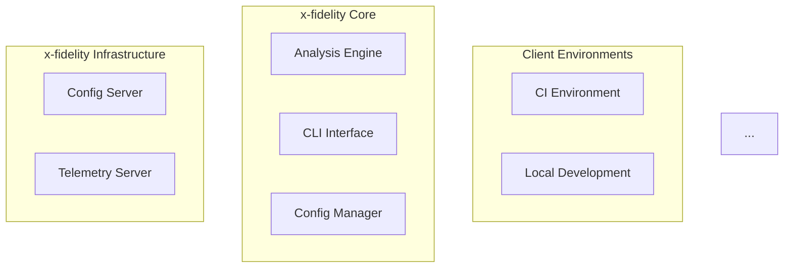

# Topic: README Conventions

## Fact: Root README Follows A Comprehensive 18-Section Structure
### Modified: 2026-01-29
### Priority: H

The root `README.md` (1100+ lines) follows a comprehensive structure designed to serve both quick-start users and those needing detailed documentation:

**Opening (hook users):**
1. ASCII logo banner
2. Project tagline and description
3. Quick start sections (CLI and VSCode Extension)

**Table of Contents:**
4. Intent and Purpose
5. Key Features (with subsections for Package Size Analysis, Rule Builder GUI)
6. Components and Entity Names (Archetype, Rule, Exemption, Operator, Fact, etc.)
7. System Architecture (with Mermaid diagram)

**Configuration:**
8. Configuring and Extending (Archetypes, Rules, Operators)
9. Installation (CLI and VSCode Extension)
10. Advanced Usage (Telemetry, Command-line options)
11. Environment Variables
12. Central Configuration Management
13. Local Configuration
14. Remote Configuration

**Server & CI:**
15. Hosting Config Servers (Docker examples)
16. Exemptions
17. CI Pipeline Integration

**Advanced Features:**
18. OpenAI Integration
19. Best Practices
20. Using .xfi-config.json
21. Plugins
22. Contributing/License

**Key conventions:**
- Mermaid diagrams for architecture
- JSON examples for configuration
- Command examples with comments
- Tables for structured data

### References
1. [README.md](../../README.md)

---

## Fact: Package READMEs Follow A Consistent Structure Template
### Modified: 2026-01-29
### Priority: H

Package-level READMEs (e.g., `packages/x-fidelity-vscode/README.md`) follow a consistent structure:

**Standard sections:**
1. **Title and Description** - Package name and what it does
2. **What is X-Fidelity?** - Context about the parent project
3. **Installation** - Package-specific installation steps
4. **Quick Start** - Getting started in minutes
5. **Key Features** - Feature list with subsections
6. **Configuration** - Settings with JSON examples
7. **User Interface** - UI components description
8. **Commands** - Available commands with descriptions
9. **Working with [Domain]** - Domain-specific workflows
10. **Output Files** - Generated files and their purposes
11. **Troubleshooting** - Common issues and solutions
12. **Best Practices** - Recommended usage patterns
13. **Learn More** - Links to full documentation

**Formatting conventions:**
- Emoji headers for visual scanning (🚀, 🎯, 🔧, 📋, etc.)
- JSON code blocks for configuration examples
- Tables for structured data (settings, commands)
- Bullet lists for features and actions
- Severity indicators (🔴 Error, 🟡 Warning, 🔵 Info, 💡 Hint)

### References
1. [packages/x-fidelity-vscode/README.md](../../packages/x-fidelity-vscode/README.md)
2. [packages/x-fidelity-cli/README.md](../../packages/x-fidelity-cli/README.md)

---

## Fact: Branch Protection And Version Sync Are Documented In README
### Modified: 2026-01-29
### Priority: M

The root README includes operational documentation for repository management:

**Branch Protection Setup section:**
```markdown
## 📋 Branch Protection Setup

Required status checks for `master` branch:
✅ build-and-test (from CI workflow)
✅ test-extension (from VSCode Extension CI workflow)
✅ check-version-sync (from PR Version Sync workflow)

Settings:
- ✅ Require status checks to pass before merging
- ✅ Require branches to be up to date before merging
- ✅ Include administrators
```

**Version Synchronization section:**
```markdown
## 🔄 Automated Version Synchronization

### PR-Level Synchronization
- VSCode changes without CLI release → Adds bump commit to CLI
- Automatic PR comments explain sync actions

### Release-Level Synchronization
- CLI release without VSCode changes → Adds bump commit to VSCode
- Clean git history maintains placeholders

### Result
Both packages always maintain synchronized versions
```

This operational documentation helps maintainers understand CI/CD requirements without digging through workflow files.

### References
1. [README.md](../../README.md)
2. [.github/workflows/ci.yml](../../.github/workflows/ci.yml)
3. [.github/workflows/release-unified.yml](../../.github/workflows/release-unified.yml)

---

## Fact: Mermaid Diagrams Are Used For Architecture Visualization
### Modified: 2026-01-29
### Priority: M

Both README.md and website documentation use Mermaid diagrams for architecture visualization:

**System Architecture diagram in README:**


**Diagram conventions:**
- Use subgraphs to group related components
- Use descriptive labels for nodes
- Show data flow with arrows and labels
- Use dashed lines for optional connections (`-.->`)
- Add classDef for styling optional components

**Mermaid is enabled in:**
- README.md (GitHub renders natively)
- Docusaurus (via `@docusaurus/theme-mermaid`)

When adding new architecture documentation, prefer Mermaid over static images for maintainability.

### References
1. [README.md](../../README.md)
2. [website/docusaurus.config.js](../../website/docusaurus.config.js)
