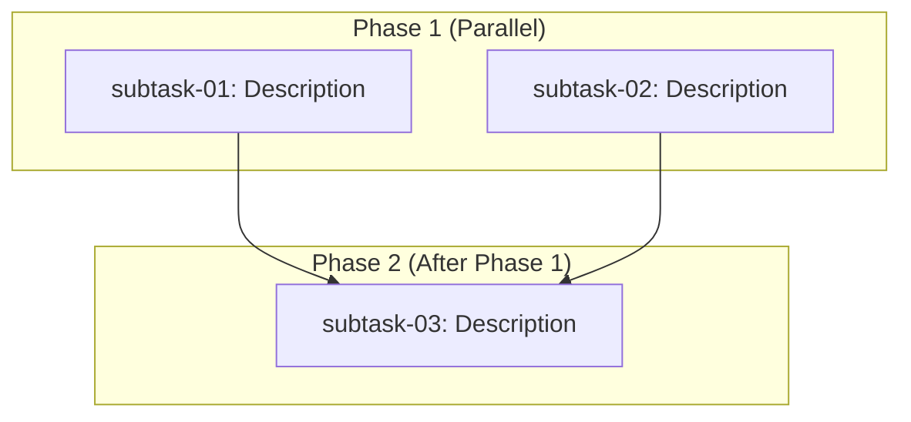

# Topic: Subtask Coordination Patterns

## Fact: Dependency Graph Representation
### Modified: 2026-01-29
### Priority: H

Subtask dependencies are visualized using Mermaid diagrams in the plan index file. The graph explicitly shows which subtasks can run in parallel and which must wait for dependencies.

**Standard Graph Format**:



**Graph Conventions**:
1. Use `graph TD` for top-down layout
2. Group parallel tasks in labeled subgraphs with phase name
3. Use arrows (`-->`) to show dependencies
4. Node labels include subtask number and short description
5. Arrows point FROM dependency TO dependent task

**Dependency Types**:
- **No arrows pointing to a task** = Can start immediately
- **Multiple arrows to a task** = All dependencies must complete first
- **No arrows from a task** = Nothing depends on it

### References
1. [xfi-planner agent definition](../../.cursor/agents/xfi-planner.md)
2. [Rule Builder GUI dependency graph](../plans/20260118-rule-builder-gui/index-rule-builder-gui-20260118.md)

---

## Fact: Parallel vs Sequential Execution Strategy
### Modified: 2026-01-29
### Priority: H

Subtasks are organized into phases based on their dependencies. Within each phase, tasks execute in parallel; between phases, execution is sequential.

**Parallel Execution** (within a phase):
- Tasks with no dependencies on each other
- Spawn multiple subagents simultaneously
- Do NOT run global test suites (parallel file modifications cause conflicts)
- Each agent updates only its own subtask file
- Example: Phase 1 scaffold, plugin wrappers, and fixture bundles

**Sequential Execution** (between phases):
- Wait for ALL tasks in current phase to complete
- Verify all execution notes are filled before proceeding
- Only then spawn next phase's subagents
- Example: State management (Phase 2) must wait for scaffold (Phase 1)

**Testing Constraint**:
Due to parallel execution, subtasks should NOT trigger global tests:
- Create targeted tests for files being modified
- Run tests only on directly affected files
- Defer global test execution to final verification phase

**Real-World Example** (from Rule Builder GUI):
```
Phase 1 (Parallel):  S01 + S02 + S03  →  3 agents simultaneously
Phase 2 (Sequential): S04 (depends on S01)
Phase 3 (Parallel):  S05 + S06 + S07 + S08  →  4 agents simultaneously
Phase 4 (Sequential): S09 (depends on S02, S03, S04)
```

### References
1. [xfi-execute-plan skill](../../.cursor/skills/xfi-execute-plan/SKILL.md)
2. [Rule Builder GUI index - Execution Order](../plans/20260118-rule-builder-gui/index-rule-builder-gui-20260118.md)

---

## Fact: Subagent Delegation Guidelines
### Modified: 2026-01-29
### Priority: H

Subtasks are delegated to specialized subagents based on the work domain. The planner matches task requirements to subagent expertise.

**Subagent Selection Guide**:

| Task Type | Subagent | Typical Deliverables |
|-----------|----------|---------------------|
| General implementation | xfi-engineer | Code, unit tests, bug fixes |
| Plugin development | xfi-plugin-expert | Facts, operators, AST analysis |
| VSCode extension | xfi-vscode-expert | Extension features, webviews |
| Rule/archetype creation | xfi-rules-expert | Rule JSON, archetype config |
| Test strategy | xfi-testing-expert | Test coverage, global test runs |
| Security-sensitive work | xfi-security-expert | Path validation, secrets |
| Build/CI work | xfi-build-expert | Build config, CI pipelines |
| Documentation | xfi-docs-expert | README, website, CHANGELOG |
| Code review | xfi-code-reviewer | Quality review, security scan |
| Architecture decisions | xfi-system-design | Design docs, architecture |

**Delegation Template**:

```
Invoke [subagent-name] subagent with:

"Execute the engineering task defined in this subtask file:

**Subtask File**: knowledge/plans/[plan-dir]/subtask-[NN]-...-[yyyymmdd].md

**IMPORTANT INSTRUCTIONS**:
1. Read the subtask file carefully
2. Implement all deliverables listed
3. Follow the testing strategy (NO global tests)
4. Update the 'Execution Notes' section when done
5. Report back with summary of work completed"
```

### References
1. [xfi-planner agent definition - Available Subagents](../../.cursor/agents/xfi-planner.md)
2. [xfi-execute-plan skill - Parallel Execution](../../.cursor/skills/xfi-execute-plan/SKILL.md)

---

## Fact: Progress Tracking Conventions
### Modified: 2026-01-29
### Priority: M

The planner tracks progress through structured updates to the plan index file. This provides visibility into plan execution status.

**Progress Tracking Methods**:

1. **Completion Checklist** (in index file):
   ```markdown
   ## Completion Checklist
   - [x] Subtask 01: Completed - SPA scaffold created
   - [x] Subtask 02: Completed - Browser plugins wrapped
   - [ ] Subtask 03: In Progress
   - [ ] Subtask 04: Pending
   ```

2. **Execution Progress Table** (optional, for complex plans):
   ```markdown
   | Phase | Subtask | Status | Started | Completed | Notes |
   |-------|---------|--------|---------|-----------|-------|
   | 1 | 01 | Completed | 10:00 | 10:45 | All deliverables met |
   | 1 | 02 | Completed | 10:00 | 11:30 | Minor issue resolved |
   | 2 | 03 | In Progress | 11:35 | - | Working on state |
   ```

3. **Execution Notes** (summary by phase):
   ```markdown
   ## Execution Notes
   
   ### Phase 1 Completed: 2026-01-29
   - Subtask 01: Created scaffold with Vite + React
   - Subtask 02: Wrapped 4 plugins for browser
   
   ### Issues Encountered
   - [Issue]: WASM loading required path fix
   ```

**Update Frequency**:
- Update after each subtask completes
- Note blockers immediately when discovered
- Update phase summary after phase completes

### References
1. [xfi-execute-plan skill - Tracking Progress](../../.cursor/skills/xfi-execute-plan/SKILL.md)
2. [Rule Builder GUI execution notes](../plans/20260118-rule-builder-gui/index-rule-builder-gui-20260118.md)

---
