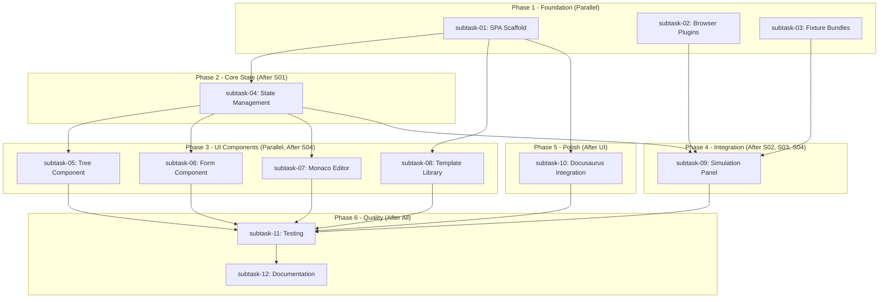

# Plan: Rule Builder GUI

## Status
Completed

## Overview
Create a web-based GUI for creation of new X-Fidelity rules using the plugins, facts, operators, and other assets from the repository. The GUI will be a client-side only standalone React SPA embedded in the existing documentation website, providing an interactive experience for creating rule JSON with full simulation capabilities.

## Key Decisions

1. **Full Complexity Support**: Complete json-rules-engine capabilities including nested conditions (`all`, `any`, `not`), multiple events, priority, and custom operators. Includes tooltips and guides throughout the UI.

2. **Full Simulation Mode**: Run rules against actual fixture data in-browser using bundled X-Fidelity plugins. Provides immediate feedback on rule behavior.

3. **Copy-to-Clipboard Export**: Standalone rules only with naming convention guidance. No archetype editing (scope control).

4. **Hybrid Tree + Form UI**: Three-panel layout with tree navigation, form editing, and live bidirectional JSON editing via Monaco editor.

5. **Comprehensive Template Library**: Templates sourced from `democonfig/rules/` plus new teaching templates. Categorized by plugin type, use case, and complexity level.

6. **Core Plugins Only (v1)**: filesystem, ast, dependency, react-patterns. OpenAI and remote-validator deferred to future iterations.

7. **Standalone React SPA**: Located in `website/rule-builder/` with Vite build, Radix UI + Tailwind for components, integrated with Docusaurus theme via shared CSS variables.

## Requirements

1. Client-side only (no backend/server required)
2. Embedded in existing website as top menu item
3. Full json-rules-engine complexity with tooltips and guides
4. Full simulation mode with in-browser plugin execution
5. Copy-to-clipboard export with naming convention enforcement
6. Hybrid Tree + Form UI with bidirectional live JSON editing
7. Comprehensive template library (democonfig + teaching templates)
8. Templates categorized by plugin type, use case, and complexity
9. Core plugins only: filesystem, ast, dependency, react-patterns
10. Standalone React SPA in `website/rule-builder/`
11. Radix UI + Tailwind themed to match Docusaurus
12. Integrated into existing website build process

## Design Notes

### Technology Stack
| Component | Choice | Rationale |
|-----------|--------|-----------|
| Build Tool | Vite | Fast dev server, excellent tree-shaking, native WASM support |
| Component Library | Radix UI + Tailwind | Unstyled primitives, full customization to match Docusaurus |
| JSON Editor | Monaco Editor | VSCode's editor, excellent JSON support, familiar to developers |
| Tree View | Radix Collapsible | Customizable, accessible tree component |
| State Management | Zustand | Lightweight, excellent for bidirectional sync patterns |

### Directory Structure
```
website/
├── src/pages/
│   └── rule-builder.tsx              # Docusaurus page (redirects to SPA)
├── rule-builder/                      # Standalone React SPA
│   ├── src/
│   │   ├── App.tsx                   # Main app with layout
│   │   ├── components/
│   │   │   ├── RuleTree/             # Tree navigation panel
│   │   │   ├── RuleForm/             # Form editing panel  
│   │   │   ├── JsonEditor/           # Monaco editor panel
│   │   │   ├── TemplateLibrary/      # Template browser
│   │   │   └── SimulationPanel/      # Rule simulation UI
│   │   ├── hooks/
│   │   │   ├── useRuleState.ts       # Bidirectional sync state
│   │   │   └── useSimulation.ts      # Plugin execution
│   │   ├── lib/
│   │   │   ├── plugins/              # Browser-bundled plugins
│   │   │   ├── fixtures/             # Bundled test fixtures
│   │   │   └── templates/            # Template catalog
│   │   └── types/
│   ├── package.json
│   ├── vite.config.ts
│   └── index.html
```

### Plugin Browser Bundling Strategy
1. **filesystem plugin** - No native deps, direct bundle
2. **dependency plugin** - No native deps, direct bundle
3. **ast plugin** - Requires `web-tree-sitter` WASM, Vite handles loading
4. **react-patterns plugin** - Built on AST, bundles with it

Browser wrappers will:
- Replace Node.js `fs` operations with pre-loaded fixture data
- Configure WASM paths for browser loading
- Provide mock `ExecutionContext` for logging

### Risks
1. **Tree-sitter WASM in browser** - May have CORS/loading issues
2. **Bundle size** - Plugins + Monaco + WASM could be large; needs code splitting
3. **Bidirectional sync** - Must prevent infinite loops between tree/form/JSON
4. **Plugin abstraction** - Some plugin internals assume Node.js environment

## Subtask Dependency Graph



## Execution Order

### Phase 1 (Parallel - No Dependencies)
| Subtask | Subagent | Description | Dependencies |
|---------|----------|-------------|--------------|
| 01 | xfi-engineer | Set up rule-builder SPA scaffold with Vite + Radix + Tailwind | None |
| 02 | xfi-plugin-expert | Create browser-compatible plugin wrappers | None |
| 03 | xfi-engineer | Build JSON fixture bundles for simulation | None |

### Phase 2 (After Phase 1 - S01)
| Subtask | Subagent | Description | Dependencies |
|---------|----------|-------------|--------------|
| 04 | xfi-engineer | Implement bidirectional state management with Zustand | 01 |

### Phase 3 (Parallel - After Phase 2)
| Subtask | Subagent | Description | Dependencies |
|---------|----------|-------------|--------------|
| 05 | xfi-engineer | Build Tree navigation component | 01, 04 |
| 06 | xfi-engineer | Build Form editing component with tooltips | 01, 04 |
| 07 | xfi-engineer | Integrate Monaco JSON editor with sync | 01, 04 |
| 08 | xfi-engineer | Build template library UI and catalog | 01 |

### Phase 4 (After S02, S03, S04)
| Subtask | Subagent | Description | Dependencies |
|---------|----------|-------------|--------------|
| 09 | xfi-plugin-expert | Implement simulation panel with plugin execution | 02, 03, 04 |

### Phase 5 (After S01)
| Subtask | Subagent | Description | Dependencies |
|---------|----------|-------------|--------------|
| 10 | xfi-docs-expert | Integrate with Docusaurus navbar and theming | 01 |

### Phase 6 (After All Components)
| Subtask | Subagent | Description | Dependencies |
|---------|----------|-------------|--------------|
| 11 | xfi-testing-expert | Add comprehensive tests | 05, 06, 07, 08, 09, 10 |
| 12 | xfi-docs-expert | Update documentation | 11 |

## Global Definition of Done
- [ ] All subtasks completed
- [ ] All unit tests passing
- [ ] Code review by xfi-code-reviewer completed
- [ ] Architecture review by xfi-system-design completed
- [ ] Global test suite passing (verified by xfi-testing-expert)
- [ ] Documentation updated by xfi-docs-expert
- [ ] Knowledge captured by xfi-system-design
- [ ] User approval received

## Execution Notes

### Phase 1 Completed: 2026-01-18

**Subtask 01 - SPA Scaffold (xfi-engineer)**:
- Created website/rule-builder/ with Vite 6 + React 18 + TypeScript 5
- Three-panel layout with Header, RuleTree, RuleForm, JsonEditor panels
- Collapsible SimulationPanel at bottom
- Tailwind CSS + Radix UI configured
- CSS variables matching Docusaurus theme
- Build verified: yarn install, yarn dev, yarn build all succeed

**Subtask 02 - Browser Plugins (xfi-plugin-expert)**:
- Created 18 plugin files in website/rule-builder/src/lib/plugins/
- Implemented filesystem, dependency, ast, react-patterns browser wrappers
- web-tree-sitter WASM integration for AST parsing
- Mock ExecutionContext with console logging
- Unified plugin registry with original plugin name mappings

**Subtask 03 - Fixture Bundles (xfi-engineer)**:
- Created bundle-fixtures.mjs script
- Bundled 33 files from node-fullstack fixture (113.32 KB)
- FixtureLoader API with search, filter, tree traversal
- Metadata system with rule descriptions and trigger mappings
- Excludes node_modules, binary files, large files

## Completion Checklist
- [x] Subtask 01: SPA Scaffold - Completed
- [x] Subtask 02: Browser Plugins - Completed
- [x] Subtask 03: Fixture Bundles - Completed
- [x] Subtask 04: State Management - Completed
- [x] Subtask 05: Tree Component - Completed
- [x] Subtask 06: Form Component - Completed
- [x] Subtask 07: Monaco Editor - Completed
- [x] Subtask 08: Template Library - Completed
- [x] Subtask 09: Simulation Panel - Completed
- [x] Subtask 10: Docusaurus Integration - Completed
- [x] Subtask 11: Testing - Completed (298 tests passing)
- [x] Subtask 12: Documentation - Completed
- [x] Final code review: Passed - No critical issues
- [x] Final architecture review: Passed - High alignment (95%+)
- [x] Global tests verified: 2,090 tests passing
- [x] Documentation updated
- [x] Knowledge captured

## Completion Summary
- **Started**: 2026-01-18
- **Completed**: 2026-01-18
- **Subtasks Executed**: 12
- **Files Modified**: 188
- **Lines Added**: 33,711
- **Tests Added**: 298

## Final Commit
```
feat(website): add interactive Rule Builder GUI for visual rule creation
Commit: 698e7742
```

## Lessons Learned
1. **WASM in browser**: web-tree-sitter works well but needs proper path configuration for production builds
2. **Bidirectional sync**: Source tracking pattern (`UpdateSource`) effectively prevents infinite loops
3. **Parallel subtask execution**: Phase 1 and Phase 3 parallelization significantly reduced total execution time
4. **Browser plugin abstraction**: Complete separation from Node.js APIs enables true client-side execution
5. **Radix UI + Tailwind**: Excellent combination for accessible, themeable components
6. **Zustand with immer**: Simple yet powerful state management with immutable updates

## Execution Instructions

To execute this plan in a new agent session:

1. Start a new conversation
2. Run: `/xfi-plan-execute`
3. Select this plan: `20260118-rule-builder-gui`
4. Confirm execution summary
5. Monitor subtask progress
6. Review final changes when prompted
7. Approve documentation updates
