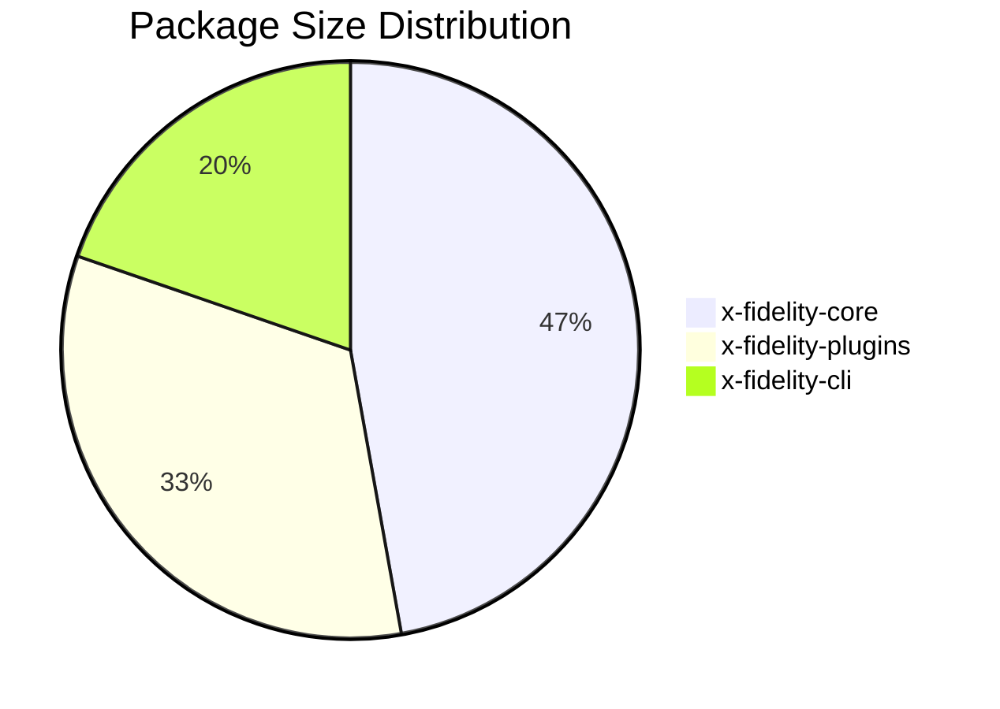

# Subtask: Report Generator Integration

## Metadata
- **Subtask ID**: 07
- **Feature**: Package Filesize Rule
- **Assigned Subagent**: xfi-engineer
- **Dependencies**: 03
- **Created**: 20260123

## Objective
Integrate package size data into the X-Fidelity analysis report (markdown), adding a dedicated section that displays package sizes in a formatted table with threshold status.

## Deliverables Checklist
- [x] Add `generatePackageSizeSection()` method to ReportGenerator
- [x] Include package size table in report output
- [x] Show threshold violations in the section
- [x] Add file type breakdown if available
- [x] Add mermaid chart for size visualization
- [x] Update ReportGenerator tests

## Definition of Done
- [x] Package size section appears in generated reports
- [x] Section only appears if package size data is available
- [x] Table is properly formatted in markdown
- [x] Threshold violations are highlighted
- [x] Unit tests cover the new section generation
- [x] No lint errors in modified files

## Implementation Notes

### Report Generator Update

Add to `packages/x-fidelity-core/src/notifications/reportGenerator.ts`:

```typescript
import { PackageSizeResult, PackageSizeInfo } from '@x-fidelity/plugins';
import { formatBytes } from '@x-fidelity/plugins/xfiPluginPackageSize/utils/sizeFormatter';

// Add to generateReport() method call chain:
report.push(this.generatePackageSizeSection());

/**
 * Generate package size analysis section
 */
private generatePackageSizeSection(): string {
    // Look for package size data in the issue details or fact results
    const packageSizeData = this.extractPackageSizeData();
    
    if (!packageSizeData || packageSizeData.packages.length === 0) {
        return '';  // No section if no data
    }
    
    const { packages, totalSize, isMonorepo, workspaceType } = packageSizeData;
    
    // Sort by total size descending
    const sortedPackages = [...packages].sort((a, b) => b.totalSize - a.totalSize);
    
    // Build section header
    let section = `## Package Size Analysis

This monorepo contains **${packages.length} packages** with a total size of **${formatBytes(totalSize)}**.

**Workspace Type:** ${workspaceType} ${isMonorepo ? '(monorepo)' : '(single package)'}

`;

    // Add size distribution chart
    section += this.generatePackageSizeChart(sortedPackages);
    
    // Add detailed table
    section += `
### Package Size Details

| Package | Source | Build | Total | Status |
|---------|--------|-------|-------|--------|
`;
    
    for (const pkg of sortedPackages) {
        const status = this.getPackageSizeStatus(pkg);
        section += `| ${pkg.name} | ${formatBytes(pkg.sourceSize)} | ${formatBytes(pkg.buildSize)} | ${formatBytes(pkg.totalSize)} | ${status} |\n`;
    }
    
    // Add breakdown section if available
    if (packages.some(p => Object.keys(p.fileTypeBreakdown || {}).length > 0)) {
        section += this.generateFileTypeBreakdownSection(sortedPackages);
    }
    
    return section;
}

/**
 * Generate mermaid pie chart for package sizes
 */
private generatePackageSizeChart(packages: PackageSizeInfo[]): string {
    // Take top 8 packages for readability
    const topPackages = packages.slice(0, 8);
    
    const pieData = topPackages.map(pkg => 
        `    "${pkg.name}" : ${pkg.totalSize}`
    ).join('\n');
    
    return `### Size Distribution

\`\`\`mermaid
pie
    title Package Size Distribution
${pieData}
\`\`\`

`;
}

/**
 * Get status indicator for package size
 */
private getPackageSizeStatus(pkg: PackageSizeInfo): string {
    if (pkg.exceedsFatality) {
        return '🔥 **OVER LIMIT**';
    } else if (pkg.exceedsWarning) {
        return '⚠️ Warning';
    }
    return '✅ OK';
}

/**
 * Generate file type breakdown section
 */
private generateFileTypeBreakdownSection(packages: PackageSizeInfo[]): string {
    let section = `
### File Type Breakdown

| Package | Top File Types |
|---------|----------------|
`;
    
    for (const pkg of packages) {
        const breakdown = pkg.fileTypeBreakdown || {};
        const sorted = Object.entries(breakdown)
            .sort(([, a], [, b]) => b - a)
            .slice(0, 3)
            .map(([ext, bytes]) => `${ext}: ${formatBytes(bytes)}`)
            .join(', ');
        
        section += `| ${pkg.name} | ${sorted || 'N/A'} |\n`;
    }
    
    return section;
}

/**
 * Extract package size data from analysis results
 */
private extractPackageSizeData(): PackageSizeResult | null {
    // Look in issue details for package size fact results
    // The fact stores its result which should be accessible
    
    // Check for global issues with packageSize data
    const globalIssues = this.data.XFI_RESULT.issueDetails
        .filter(d => d.filePath === 'REPO_GLOBAL_CHECK');
    
    for (const issue of globalIssues) {
        for (const error of issue.errors) {
            if (error.ruleFailure?.includes('packageSize') && error.details?.details) {
                return error.details.details as PackageSizeResult;
            }
        }
    }
    
    // Also check fact results if available
    if (this.data.XFI_RESULT.factResults?.packageSize) {
        return this.data.XFI_RESULT.factResults.packageSize as PackageSizeResult;
    }
    
    return null;
}
```

### Integration with ResultMetadata

Ensure the package size fact result is stored in the analysis output so the report generator can access it. This may require updating how fact results are captured in the engine.

### Report Output Example

```markdown
## Package Size Analysis

This monorepo contains **6 packages** with a total size of **2.3 MB**.

**Workspace Type:** yarn (monorepo)

### Size Distribution



### Package Size Details

| Package | Source | Build | Total | Status |
|---------|--------|-------|-------|--------|
| x-fidelity-core | 245.3 KB | 312.1 KB | 557.4 KB | ✅ OK |
| x-fidelity-plugins | 189.7 KB | 201.5 KB | 391.2 KB | ✅ OK |
| x-fidelity-cli | 87.2 KB | 145.8 KB | 233.0 KB | ✅ OK |

### File Type Breakdown

| Package | Top File Types |
|---------|----------------|
| x-fidelity-core | .ts: 200 KB, .json: 30 KB, .js: 15 KB |
```

### Reference Files
- `packages/x-fidelity-core/src/notifications/reportGenerator.ts`
- `packages/x-fidelity-core/src/notifications/reportGenerator.integration.test.ts`

## Testing Strategy
**IMPORTANT**: Do NOT trigger global test suites. Instead:
- Add targeted tests in `reportGenerator.test.ts` or `reportGenerator.integration.test.ts`
- Mock package size data for testing
- Verify markdown output formatting
- Run: `yarn workspace @x-fidelity/core test -- --testPathPattern="reportGenerator"`

### Test Cases
1. No package size data - section should not appear
2. Single package - proper table formatting
3. Multiple packages - sorted by size, proper table
4. Packages with threshold violations - correct status icons
5. File type breakdown - proper formatting
6. Mermaid chart generation - valid mermaid syntax

## Execution Notes

### Agent Session Info
- Agent: xfi-engineer
- Started: 2026-01-23
- Completed: 2026-01-23

### Work Log

1. **Analyzed existing ReportGenerator structure** - Reviewed the existing report generation methods and patterns used for other sections like complexity issues, dependency issues, etc.

2. **Added PackageSizeInfo and PackageSizeResult interfaces** - Defined local types in reportGenerator.ts to avoid circular dependencies with the plugins package.

3. **Implemented `generatePackageSizeSection()` method** - Main method that:
   - Extracts package size data from fact results or issue details
   - Sorts packages by total size descending
   - Generates a formatted markdown section with header, pie chart, and details table
   - Only returns content if package size data is available

4. **Implemented helper methods:**
   - `generatePackageSizeChart()` - Generates mermaid pie chart for top 8 packages
   - `getPackageSizeStatus()` - Returns status indicator (✅ OK, ⚠️ Warning, 🔥 OVER LIMIT)
   - `generateFileTypeBreakdownSection()` - Shows top 3 file types per package
   - `extractPackageSizeData()` - Extracts data from factResults or issue details
   - `isPackageSizeResult()` - Type guard for validating package size data
   - `formatBytesForReport()` - Local implementation of byte formatting

5. **Integrated into report generation** - Added `generatePackageSizeSection()` call in `generateReport()` after repository overview

6. **Added comprehensive tests** - 36 new test cases covering:
   - Empty data handling
   - Data from factResults
   - Data from issue details
   - Fatality/warning status display
   - File type breakdowns
   - Package sorting
   - Pie chart generation
   - Type guard validation
   - Byte formatting

### Blockers Encountered
- None. Implementation was straightforward following existing patterns.

### Files Modified
- `packages/x-fidelity-core/src/notifications/reportGenerator.ts` - Added package size section methods and types
- `packages/x-fidelity-core/src/notifications/reportGenerator.test.ts` - Added 36 new test cases for package size functionality

### Test Results
- All 132 tests pass (96 existing + 36 new)
- No lint errors
- Type checking passes
