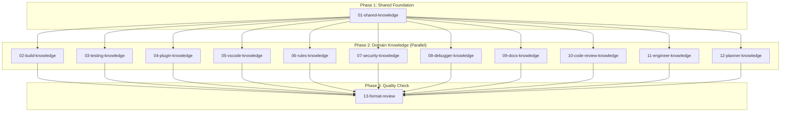

# Plan: Agent Knowledge Population

## Status
Completed

## Overview
Populate all X-Fidelity agent knowledge directories with focused, high-value facts about their domains. Each agent explores the codebase from their specialized perspective and creates 2-3 DRAFT knowledge files documenting key patterns, conventions, and critical information.

## Key Decisions
- **Scope: Focused Starter Set**: Each agent creates 2-3 topic files covering most critical knowledge (not comprehensive)
- **Execution: Shared-First, Then Parallel**: xfi-system-design populates shared knowledge first, then all 12 agents run in parallel
- **Status: All DRAFT**: Every knowledge file starts as DRAFT for user review before promotion
- **Topic Selection: Guided**: Each agent receives specific topic suggestions based on codebase structure
- **Shared Scope: Minimal**: Only ~2 files covering package structure and core data flow
- **Review: Cross-Agent Spot Check**: xfi-code-reviewer validates format consistency in Phase 3

## Requirements
1. All knowledge files follow naming convention: `[ORDERING]-[topic]-DRAFT-260129.md`
2. All facts follow the schema: `## Fact:` / `### Modified:` / `### Priority:` / `### References`
3. Each agent creates 2-3 topic files in their knowledge directory
4. All files must include source file references as evidence
5. No code files are modified - only knowledge markdown files

## Subtask Dependency Graph

## Execution Order

### Phase 1: Shared Foundation (Sequential)
| Subtask | Subagent | Description | Dependencies |
|---------|----------|-------------|--------------|
| 01 | xfi-system-design | Populate `knowledge/shared/` with cross-cutting architecture | None |

### Phase 2: Domain Knowledge (Parallel - after Phase 1)
| Subtask | Subagent | Description | Dependencies |
|---------|----------|-------------|--------------|
| 02 | xfi-build-expert | Build system knowledge | 01 |
| 03 | xfi-testing-expert | Testing patterns knowledge | 01 |
| 04 | xfi-plugin-expert | Plugin architecture knowledge | 01 |
| 05 | xfi-vscode-expert | VSCode extension knowledge | 01 |
| 06 | xfi-rules-expert | Rules engine knowledge | 01 |
| 07 | xfi-security-expert | Security patterns knowledge | 01 |
| 08 | xfi-debugger | Debugging patterns knowledge | 01 |
| 09 | xfi-docs-expert | Documentation patterns knowledge | 01 |
| 10 | xfi-code-reviewer | Code review patterns knowledge | 01 |
| 11 | xfi-engineer | Engineering patterns knowledge | 01 |
| 12 | xfi-planner | Planning workflow knowledge | 01 |

### Phase 3: Quality Check (Sequential - after Phase 2)
| Subtask | Subagent | Description | Dependencies |
|---------|----------|-------------|--------------|
| 13 | xfi-code-reviewer | Validate format consistency across all knowledge files | 02-12 |

## Global Definition of Done
- [x] All 13 subtasks completed
- [x] All knowledge files follow naming convention
- [x] All facts follow the required schema
- [x] All facts include source references
- [x] Format consistency validated by xfi-code-reviewer
- [x] User has reviewed all DRAFT files

## Execution Notes

### Phase 1 Completed: 2026-01-29
- Subtask 01 (xfi-system-design): Created 2 shared knowledge files covering package structure and core data flow

### Phase 2 Completed: 2026-01-29
All 11 domain agents executed in parallel:
- Subtask 02 (xfi-build-expert): 3 files - Turbo pipelines, esbuild bundling, yarn workspaces
- Subtask 03 (xfi-testing-expert): 3 files - Jest configuration, test organization, coverage requirements
- Subtask 04 (xfi-plugin-expert): 3 files - Plugin structure, fact/operator patterns, tree-sitter AST
- Subtask 05 (xfi-vscode-expert): 3 files - Extension architecture, tree view patterns, diagnostic integration
- Subtask 06 (xfi-rules-expert): 3 files - Rule JSON structure, archetype configuration, exemption patterns
- Subtask 07 (xfi-security-expert): 3 files - Path validation, input sanitization, webhook security
- Subtask 08 (xfi-debugger): 3 files - StandardError patterns, logging conventions, troubleshooting
- Subtask 09 (xfi-docs-expert): 3 files - Documentation structure, Docusaurus patterns, README conventions
- Subtask 10 (xfi-code-reviewer): 3 files - Code review patterns, quality standards, common issues
- Subtask 11 (xfi-engineer): 3 files - Implementation patterns, coding conventions, common utilities
- Subtask 12 (xfi-planner): 3 files - Plan structure, subtask coordination, execution workflow

## Completion Checklist
- [x] Subtask 01: Shared Knowledge - Completed (2 files)
- [x] Subtask 02: Build Knowledge - Completed (3 files)
- [x] Subtask 03: Testing Knowledge - Completed (3 files)
- [x] Subtask 04: Plugin Knowledge - Completed (3 files)
- [x] Subtask 05: VSCode Knowledge - Completed (3 files)
- [x] Subtask 06: Rules Knowledge - Completed (3 files)
- [x] Subtask 07: Security Knowledge - Completed (3 files)
- [x] Subtask 08: Debugger Knowledge - Completed (3 files)
- [x] Subtask 09: Docs Knowledge - Completed (3 files)
- [x] Subtask 10: Code Review Knowledge - Completed (3 files)
- [x] Subtask 11: Engineer Knowledge - Completed (3 files)
- [x] Subtask 12: Planner Knowledge - Completed (3 files)
- [x] Subtask 13: Format Review - Completed (35 files reviewed, 0 issues)
- [x] User final review completed

## Completion Summary
- **Started**: 2026-01-29
- **Completed**: 2026-01-29
- **Subtasks Executed**: 13
- **Knowledge Files Created**: 35
- **Total Facts Documented**: ~140
- **Format Issues Found**: 0

## Lessons Learned
1. **Parallel execution works well for independent knowledge domains** - Phase 2 ran 11 agents in parallel with no conflicts
2. **Structured format requirements ensure consistency** - All 35 files passed format review with 0 issues
3. **Source file references add verifiability** - Every fact can be traced back to codebase files
4. **DRAFT status enables user review** - All files ready for promotion to CONFIRMED as verified

## Post-Completion Notes
- **2026-01-29**: All 35 DRAFT files promoted to CONFIRMED status by user
