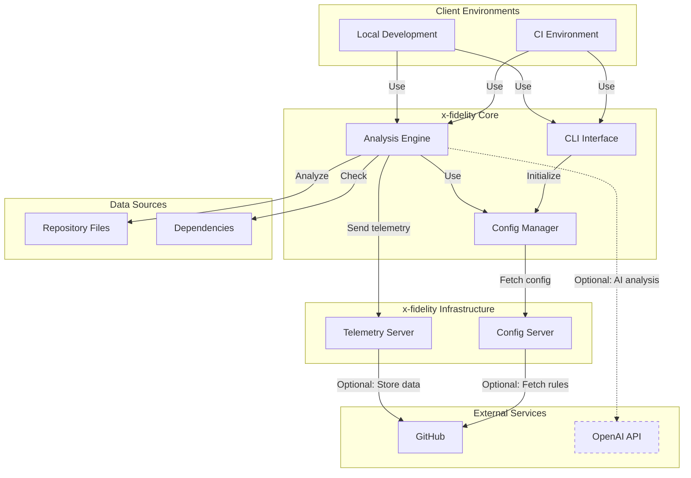

# Introduction to x-fidelity

x-fidelity is an advanced CLI tool and paired config server designed to perform opinionated framework adherence checks within a codebase. It provides a flexible and extensible way to ensure your projects are using specific standards, tools and best practices.

## Key Features

- **Flexible Archetype System**: Define custom project archetypes with specific rules and configurations
- **Customizable Rules**: Create and apply rules for various aspects of your codebase
- **Directory Structure Validation**: Ensure your project follows a predefined directory structure
- **Dependency Version Checking**: Verify that your project uses up-to-date dependencies
- **Content Analysis**: Search for specific patterns or strings within your codebase
- **Remote Configuration**: Fetch configurations from a remote server for centralized management
- **OpenAI Integration**: Leverage AI for advanced code analysis and suggestions
- **Extensible Architecture**: Easily add new operators, facts, rules, and plugins

## System Architecture



## Quick Start

```bash
# Install x-fidelity
yarn global add x-fidelity
export PATH="$PATH:$(yarn global bin)"

# Run in current directory
xfidelity .
```

For more detailed information about getting started with x-fidelity, check out our [Getting Started](getting-started) guide.
