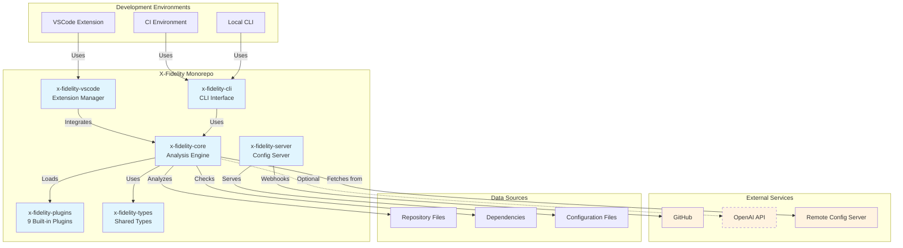

# Introduction to X-Fidelity

X-Fidelity is a comprehensive code analysis framework that provides opinionated adherence checks for your codebase. Available as both a command-line tool and VSCode extension, it offers a flexible and extensible way to ensure your projects follow specific standards, tools, and best practices.

## Key Features

> Start here: See the 5‑minute [Quickstart](./quickstart) to run your first analysis.

### Core Capabilities
- **Flexible Archetype System**: Define custom project archetypes with specific rules and configurations
- **Comprehensive Rule Engine**: JSON-based rules engine with conditions and actions
- **Advanced Analysis**: AST-based code analysis with Tree-sitter, dependency checking, and pattern matching
- **Plugin Architecture**: 9 built-in plugins with universal logging system and custom extension support
- **Performance Optimization**: File caching, TTL-based invalidation, and performance monitoring

### User Interfaces
- **VSCode Extension**: 47 commands, real-time analysis, Problems panel integration, 40+ settings
- **Command Line Interface**: Enhanced performance with caching, multiple output formats, server mode
- **Configuration Server**: Centralized rule management with cache TTL and webhook support

### Integration Features
- **Remote Configuration**: Fetch configurations from a remote server for team consistency
- **OpenAI Integration**: AI-powered code analysis and suggestions
- **CI/CD Support**: Seamless integration with GitHub Actions, GitLab CI, and Jenkins
- **Telemetry & Monitoring**: Built-in performance tracking and usage analytics

## Monorepo Architecture

X-Fidelity is organized as a monorepo with specialized packages:

- **`x-fidelity-core`**: Core analysis engine and utilities
- **`x-fidelity-vscode`**: VSCode extension for integrated development
- **`x-fidelity-cli`**: Command-line interface
- **`x-fidelity-server`**: Configuration server for centralized management
- **`x-fidelity-plugins`**: 9 built-in plugins (AST, filesystem, dependency, etc.)
- **`x-fidelity-types`**: Shared TypeScript type definitions
- **`x-fidelity-democonfig`**: Demo configurations and example rules
- **`x-fidelity-fixtures`**: Test fixtures and example projects

## System Architecture



## Quick Start

### Choose Your Interface

#### VSCode Extension (Recommended for Development)
```bash
# Install from marketplace (zero setup)
# Search "X-Fidelity" in VSCode extensions

# OR for development
git clone https://github.com/zotoio/x-fidelity.git
cd x-fidelity
yarn install && yarn build

# Launch VSCode extension in debug mode
yarn vscode:dev
```

#### Command Line Interface
```bash
# Install CLI tool
yarn global add x-fidelity
export PATH="$PATH:$(yarn global bin)"

# Run analysis (uses bundled CLI in VSCode by default)
xfidelity .

# Advanced usage
xfidelity . --archetype node-fullstack --output-format json
```

## Next Steps

- **[Quickstart](/docs/quickstart)** - Run your first analysis in minutes
- **[VSCode Extension](/docs/vscode-extension/overview)** - Full-featured development experience  
- **[Key Concepts](/docs/key-concepts)** - Understanding archetypes, rules, and facts
- **[Plugin Development](/docs/plugins/overview)** - Extending X-Fidelity functionality
