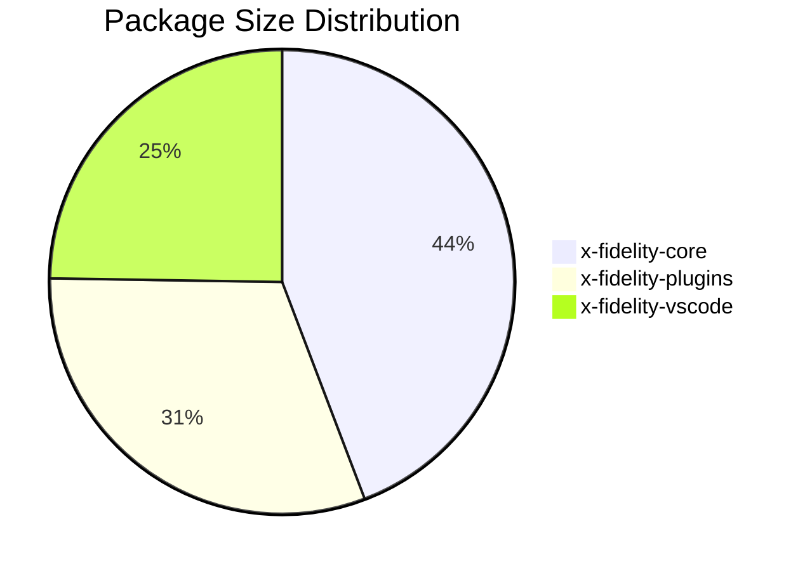

# Package Size Plugin

The Package Size plugin (`xfiPluginPackageSize`) analyzes the size of packages in a monorepo and alerts when packages exceed configured thresholds. It's designed to help teams monitor and control package bloat across their workspace.

## Features

- **Automatic Monorepo Detection**: Detects yarn, npm, and pnpm workspaces automatically
- **Size Calculation**: Measures total package size excluding `node_modules`
- **Source vs Build Separation**: Distinguishes between source code and build output
- **File Type Breakdown**: Shows which file types consume the most space
- **Configurable Thresholds**: Set custom warning and fatality limits per archetype
- **Console Table Output**: Visual summary during analysis with color-coded indicators
- **Report Integration**: Package sizes included in analysis reports with Mermaid charts

## Quick Start

Add the `packageSize-global` rule to your archetype:

```json
{
    "rules": [
        "packageSize-global"
    ],
    "plugins": [
        "xfiPluginPackageSize"
    ]
}
```

## Console Output

During analysis, a formatted table is printed to the console showing package sizes sorted by total size:

```
┌─────────────────────────────────────────────────────────────────┐
│                    Package Size Analysis                        │
├───────────────────────┬───────────┬───────────┬─────────────────┤
│ Package               │ Source    │ Build     │ Total           │
├───────────────────────┼───────────┼───────────┼─────────────────┤
│ x-fidelity-core       │ 245.3 KB  │ 312.1 KB  │ 557.4 KB        │
│ x-fidelity-plugins    │ 189.7 KB  │ 201.5 KB  │ 391.2 KB   !    │
│ x-fidelity-cli        │   89.2 KB │ 102.4 KB  │ 191.6 KB        │
└───────────────────────┴───────────┴───────────┴─────────────────┘

Total: 1.14 MB across 3 packages
Workspace: yarn (monorepo)
```

The table uses color-coded indicators:
- **Yellow with `!`**: Package exceeds warning threshold
- **Red with `!!`**: Package exceeds fatality threshold

## Fact: packageSize

The `packageSize` fact analyzes all packages in a workspace and returns detailed size information.

### Fact Parameters

| Parameter | Type | Default | Description |
|-----------|------|---------|-------------|
| `repoPath` | string | `"."` | Path to repository root |
| `sourceDirs` | string[] | `["src"]` | Directories to count as source code |
| `buildDirs` | string[] | `["dist", "build", "out", "lib"]` | Directories to count as build output |
| `includeBreakdown` | boolean | `true` | Include file type breakdown in results |
| `maxFilesPerPackage` | number | `10000` | Maximum files to scan per package |
| `noPackageSizeTable` | boolean | `false` | Suppress console table output |

### Fact Result Structure

```typescript
interface PackageSizeResult {
    packages: PackageSizeInfo[];    // Array of package size details
    totalSize: number;              // Total size in bytes
    workspaceType: 'yarn' | 'pnpm' | 'npm' | 'unknown';
    isMonorepo: boolean;            // Whether multiple packages detected
    analyzedAt: string;             // ISO timestamp
    workspaceRoot: string;          // Absolute path to workspace root
}

interface PackageSizeInfo {
    name: string;                   // Package name from package.json
    path: string;                   // Relative path from workspace root
    totalSize: number;              // Total size in bytes
    sourceSize: number;             // Source files size in bytes
    buildSize: number;              // Build output size in bytes
    sourceBreakdown: Record<string, number>;  // Size by file type
    buildBreakdown: Record<string, number>;   // Size by file type
    exceedsWarning: boolean;        // Set by operator
    exceedsFatality: boolean;       // Set by operator
}
```

## Operator: packageSizeThreshold

The `packageSizeThreshold` operator checks if any packages exceed configured size thresholds.

### Operator Parameters

| Parameter | Type | Default | Description |
|-----------|------|---------|-------------|
| `warningThresholdBytes` | number | `1048576` (1 MB) | Size at which to issue warning |
| `fatalityThresholdBytes` | number | `5242880` (5 MB) | Size at which to issue fatality |

### Threshold Reference

| Size | Bytes |
|------|-------|
| 100 KB | 102400 |
| 500 KB | 512000 |
| 1 MB | 1048576 |
| 5 MB | 5242880 |
| 10 MB | 10485760 |
| 20 MB | 20971520 |

## Configuration Examples

### Default Rule Usage

The built-in `packageSize-global` rule uses default thresholds (1 MB warning, 5 MB fatality):

```json
{
    "name": "packageSize-global",
    "conditions": {
        "all": [
            {
                "fact": "fileData",
                "path": "$.fileName",
                "operator": "equal",
                "value": "REPO_GLOBAL_CHECK"
            },
            {
                "fact": "packageSize",
                "params": {
                    "sourceDirs": ["src"],
                    "buildDirs": ["dist", "build", "out", "lib"],
                    "includeBreakdown": true
                },
                "operator": "packageSizeThreshold",
                "value": {
                    "warningThresholdBytes": 1048576,
                    "fatalityThresholdBytes": 5242880
                }
            }
        ]
    },
    "event": {
        "type": "warning",
        "params": {
            "message": "One or more packages exceed size thresholds",
            "suggestion": "Consider splitting large packages, removing unused dependencies, or optimizing assets."
        }
    }
}
```

### Custom Thresholds for Library Archetype

For npm libraries where bundle size is critical:

```json
{
    "name": "packageSize-library-global",
    "conditions": {
        "all": [
            {
                "fact": "fileData",
                "path": "$.fileName",
                "operator": "equal",
                "value": "REPO_GLOBAL_CHECK"
            },
            {
                "fact": "packageSize",
                "params": {
                    "sourceDirs": ["src", "lib"],
                    "buildDirs": ["dist", "build"]
                },
                "operator": "packageSizeThreshold",
                "value": {
                    "warningThresholdBytes": 102400,
                    "fatalityThresholdBytes": 524288
                }
            }
        ]
    },
    "event": {
        "type": "fatality",
        "params": {
            "message": "Package size exceeds limits for library distribution"
        }
    }
}
```

### Relaxed Thresholds for Applications

For applications with more flexibility:

```json
{
    "fact": "packageSize",
    "operator": "packageSizeThreshold",
    "value": {
        "warningThresholdBytes": 5242880,
        "fatalityThresholdBytes": 20971520
    }
}
```

### Custom Source/Build Directories

Configure which directories count as source vs build:

```json
{
    "fact": "packageSize",
    "params": {
        "sourceDirs": ["src", "lib", "packages"],
        "buildDirs": ["dist", "build", "out", ".next", "coverage"]
    },
    "operator": "packageSizeThreshold",
    "value": {
        "warningThresholdBytes": 1048576,
        "fatalityThresholdBytes": 5242880
    }
}
```

## Report Integration

When package size analysis is performed, the analysis report includes a dedicated section with:

- **Size Distribution Pie Chart**: Mermaid chart showing relative package sizes
- **Detailed Table**: Per-package breakdown with source, build, and total sizes
- **Status Indicators**: Warning (⚠️) and fatality (🔥) markers for packages exceeding thresholds
- **File Type Breakdown**: Which file types consume the most space

Example report section:

```markdown
## Package Size Analysis

This monorepo contains **8 packages** with a total size of **4.2 MB**.

**Workspace Type:** yarn (monorepo)

### Size Distribution



### Package Size Details

| Package | Source | Build | Total | Status |
|---------|--------|-------|-------|--------|
| x-fidelity-core | 245.3 KB | 312.1 KB | 557.4 KB | ✓ |
| x-fidelity-plugins | 189.7 KB | 201.5 KB | 391.2 KB | ⚠️ Warning |
```

## Workspace Detection

The plugin automatically detects workspace type by checking for:

1. **pnpm**: Presence of `pnpm-workspace.yaml`
2. **yarn**: Presence of `yarn.lock` with `workspaces` field in `package.json`
3. **npm**: Presence of `package-lock.json` with `workspaces` field in `package.json`

The plugin expands workspace glob patterns (e.g., `packages/*`, `apps/**`) to find all package directories.

## Suppressing Console Output

To suppress the console table output (useful in JSON output mode or CI):

```json
{
    "fact": "packageSize",
    "params": {
        "noPackageSizeTable": true
    },
    "operator": "packageSizeThreshold",
    "value": { ... }
}
```

The table is also automatically suppressed when:
- Output format is set to JSON (`--output-format json`)
- Log level is set to `error` or `fatal`

## Color Output

Console table colors respect standard environment variables:
- `NO_COLOR`: Disables all colors
- `FORCE_COLOR=1`: Forces colors even without TTY
- `XFI_LOG_COLORS=false`: X-Fidelity specific color disable

## API Reference

### Exported Functions

The plugin exports several utility functions for programmatic use:

```typescript
import { 
    formatBytes,           // Format bytes as human-readable string
    parseBytes,            // Parse "1.5 MB" to bytes
    formatBreakdown,       // Format file type breakdown
    getExceedingPackages,  // Get packages exceeding threshold
    formatThresholdMessage // Format violation message
} from '@x-fidelity/plugins/xfiPluginPackageSize';

// Format bytes
formatBytes({ bytes: 1536 }); // "1.5 KB"
formatBytes({ bytes: 1048576 }); // "1 MB"

// Parse bytes
parseBytes({ sizeStr: "1.5 MB" }); // 1572864

// Get exceeding packages
const fatalities = getExceedingPackages(result, 'fatality');
const warnings = getExceedingPackages(result, 'warning');
```

## Tips

- Start with default thresholds and adjust based on your project's needs
- Use stricter thresholds for library packages that need to minimize bundle size
- Monitor package size trends over time to catch gradual bloat
- Consider splitting large packages when they consistently exceed thresholds
- Use `--log-level debug` to see detailed file-by-file analysis
