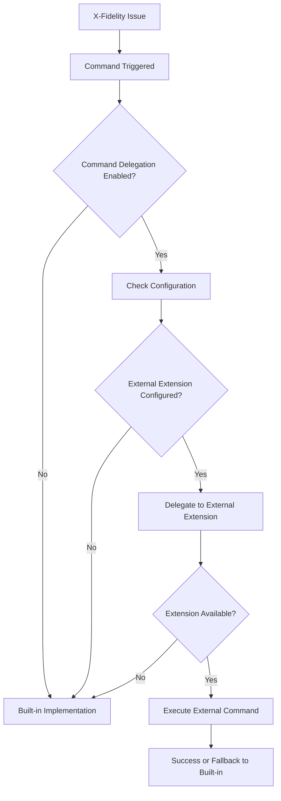

# Command Delegation System

X-Fidelity's VSCode extension includes a powerful command delegation system that allows other VSCode extensions to provide enhanced implementations for issue explanation, fixing, and batch operations.

## Overview

The command delegation system enables:
- **Extensibility**: Other extensions can provide specialized implementations
- **User Choice**: Users can configure which extension handles each command type
- **Fallback**: Default implementations when no external extension is configured
- **Discovery**: Automatic detection of compatible extensions

## How It Works

### Architecture



### Command Types

The system supports delegation for three main command types:

1. **Issue Explanation** (`explainIssue`)
   - Provides detailed explanations of code quality issues
   - Context includes rule details, file location, and issue specifics

2. **Issue Fixing** (`fixIssue`)
   - Provides automated fixes for individual issues
   - Context includes issue details and code location

3. **Batch Issue Fixing** (`fixIssueGroup`)
   - Handles fixing multiple issues in a group
   - Context includes all issues in the group and grouping criteria

## Extension Points

Other VSCode extensions can contribute to X-Fidelity by declaring extension points in their `package.json`:

### Issue Explainer Extension Point

```json
{
  "contributes": {
    "xfidelity.issueExplainer": [
      {
        "id": "my-ai-explainer",
        "displayName": "AI Code Explainer",
        "command": "myExtension.explainXFidelityIssue",
        "supportedLanguages": ["javascript", "typescript", "python"]
      }
    ],
    "commands": [
      {
        "command": "myExtension.explainXFidelityIssue",
        "title": "Explain X-Fidelity Issue with AI"
      }
    ]
  }
}
```

### Issue Fixer Extension Point

```json
{
  "contributes": {
    "xfidelity.issueFixer": [
      {
        "id": "my-auto-fixer",
        "displayName": "Auto Code Fixer",
        "command": "myExtension.fixXFidelityIssue",
        "supportsBatch": true,
        "supportedRuleTypes": ["complexity", "naming", "documentation"]
      }
    ],
    "commands": [
      {
        "command": "myExtension.fixXFidelityIssue",
        "title": "Fix X-Fidelity Issue Automatically"
      }
    ]
  }
}
```

## Command Context

### Issue Context

When delegating issue commands, X-Fidelity provides a standardized context object:

```typescript
interface IssueContext {
  ruleId: string;        // The rule that triggered the issue
  message: string;       // Issue description
  file: string;          // File path relative to workspace
  line: number;          // Line number (1-based)
  column: number;        // Column number (1-based)
  severity: string;      // 'error', 'warning', 'info', 'hint'
  category: string;      // Issue category
  fixable: boolean;      // Whether the issue is marked as fixable
}
```

### Group Context

For batch operations, X-Fidelity provides a group context:

```typescript
interface IssueGroupContext {
  groupKey: string;                                    // Group identifier
  issues: IssueContext[];                             // Array of issues in the group
  groupType: 'severity' | 'rule' | 'file' | 'category'; // How issues are grouped
}
```

## Configuration

### User Configuration

Users can configure command providers through VSCode settings:

```json
{
  "xfidelity.enableCommandDelegation": true,
  "xfidelity.commandProviders": {
    "explainIssue": "github.copilot",
    "fixIssue": "ms-vscode.auto-fixer",
    "fixIssueGroup": "built-in"
  }
}
```

### Configuration UI

X-Fidelity provides a convenient configuration interface:

1. **Command Palette**: `X-Fidelity: Configure Command Providers`
2. **Settings UI**: Navigate to Extensions → X-Fidelity → Command Providers
3. **Quick Access**: Use the "Configure Providers" button in default implementation dialogs

## Implementation Examples

### Basic Issue Explainer

```typescript
// Extension activation
export function activate(context: vscode.ExtensionContext) {
  // Register the command declared in package.json
  const disposable = vscode.commands.registerCommand(
    'myExtension.explainXFidelityIssue',
    async (issueContext: IssueContext) => {
      try {
        // Generate explanation based on issue context
        const explanation = await generateExplanation(issueContext);
        
        // Show explanation to user
        await vscode.window.showInformationMessage(
          explanation,
          { modal: true }
        );
      } catch (error) {
        vscode.window.showErrorMessage(`Failed to explain issue: ${error}`);
      }
    }
  );

  context.subscriptions.push(disposable);
}

async function generateExplanation(context: IssueContext): Promise<string> {
  return `Rule ${context.ruleId} detected in ${context.file}:${context.line}\n\n` +
         `Issue: ${context.message}\n\n` +
         `This rule helps maintain code quality by...`;
}
```

### Advanced Issue Fixer with AI

```typescript
export function activate(context: vscode.ExtensionContext) {
  // Register single issue fixer
  context.subscriptions.push(
    vscode.commands.registerCommand(
      'myExtension.fixXFidelityIssue',
      async (issueContext: IssueContext | IssueGroupContext) => {
        // Handle both single issues and groups
        if ('issues' in issueContext) {
          await handleBatchFix(issueContext);
        } else {
          await handleSingleFix(issueContext);
        }
      }
    )
  );
}

async function handleSingleFix(context: IssueContext): Promise<void> {
  // Open the file
  const document = await vscode.workspace.openTextDocument(context.file);
  const editor = await vscode.window.showTextDocument(document);

  // Generate fix using AI
  const fix = await generateAIFix(context, document);
  
  // Apply the fix
  if (fix) {
    await editor.edit(editBuilder => {
      editBuilder.replace(fix.range, fix.newText);
    });
    
    vscode.window.showInformationMessage(
      `Fixed ${context.ruleId} in ${context.file}`
    );
  }
}

async function handleBatchFix(context: IssueGroupContext): Promise<void> {
  let fixedCount = 0;
  
  for (const issue of context.issues) {
    try {
      await handleSingleFix(issue);
      fixedCount++;
    } catch (error) {
      console.error(`Failed to fix issue in ${issue.file}:`, error);
    }
  }
  
  vscode.window.showInformationMessage(
    `Fixed ${fixedCount}/${context.issues.length} issues in group "${context.groupKey}"`
  );
}
```

## Best Practices

### For Extension Developers

1. **Error Handling**: Always handle errors gracefully and provide meaningful feedback
2. **Performance**: Consider performance impact, especially for batch operations
3. **User Experience**: Provide clear progress indication for long-running operations
4. **Compatibility**: Support multiple programming languages when possible
5. **Configuration**: Allow users to configure your extension's behavior

### For Users

1. **Start Simple**: Begin with built-in implementations to understand X-Fidelity
2. **One at a Time**: Configure one command provider at a time to test functionality
3. **Monitor Performance**: Watch for performance impacts with AI-powered extensions
4. **Backup Settings**: Export your VSCode settings before making changes

## Troubleshooting

### Common Issues

**Extension not detected**
- Ensure the extension declares the correct extension points
- Check that the extension is installed and enabled
- Verify the extension point schema matches X-Fidelity's requirements

**Commands not delegating**
- Check that command delegation is enabled in settings
- Verify the configured extension ID is correct
- Look for errors in the X-Fidelity output channel

**Performance issues**
- Consider disabling AI-powered features for large files
- Use batch operations judiciously
- Monitor VSCode's performance

### Debug Information

Enable debug logging to troubleshoot delegation issues:

```json
{
  "xfidelity.debugMode": true
}
```

Check the X-Fidelity output channel for detailed delegation logs.

## Security Considerations

- **Trust**: Only install and configure trusted extensions
- **Permissions**: Review what permissions delegated extensions request
- **Data**: Be aware that issue context is shared with external extensions
- **Network**: Some extensions may make network requests with your code

## Future Enhancements

The command delegation system is designed for extensibility. Future enhancements may include:

- **Rule-specific delegation**: Configure different providers per rule type
- **Language-specific delegation**: Different providers for different programming languages
- **Provider chaining**: Try multiple providers in sequence
- **Marketplace integration**: Discover compatible extensions from the marketplace

## Contributing

To contribute to the command delegation system:

1. **Extension Points**: Suggest new extension points for additional functionality
2. **Context Enhancement**: Propose additional context information for providers
3. **UI Improvements**: Suggest improvements to the configuration interface
4. **Documentation**: Help improve this documentation with examples and use cases

## Example Extensions

Here are some hypothetical extensions that could integrate with X-Fidelity:

- **GitHub Copilot Integration**: AI-powered explanations and fixes
- **ESLint Auto-Fix**: Automatic fixing for JavaScript/TypeScript issues
- **SonarLint Integration**: Enhanced explanations with SonarQube rules
- **AI Code Review**: Comprehensive explanations using large language models
- **Team Standards Fixer**: Fixes based on team-specific coding standards

The command delegation system opens up endless possibilities for enhancing X-Fidelity's capabilities through the VSCode extension ecosystem. 